# Statistisches Gutachten: Strukturelle Benachteiligung beim Binance USD-M Futures Trading

**Datum:** 2. Juni 2026
**Analysezeitraum:** 25.01.2020 – 28.11.2025
**Produkt:** Binance Futures USD-M (USDT-margined Perpetuals)
**Datengrundlage:** Offizielle Binance-Kontoexporte — Trades, Order-Protokoll und Transaktions-Ledger
**Analyseeinheit:** **wirtschaftliche Position** (Eröffnung bis Glattstellung); Order-Ebene als Robustheitsvergleich
**Zweck:** Sachlich belastbarer, gerichtsfester Nachweis der wirtschaftlichen und statistischen
Benachteiligung des Händlers.

> **Methodischer Grundsatz.** Dieses Gutachten trennt strikt zwischen (a) **deterministisch
> belegbaren Tatsachen** (Gebührenabrechnung, Ausführungsstruktur, Liquidationen) und (b)
> **statistischen Auffälligkeiten** (Trefferquote, Verlustserien, Nicht-Zufälligkeit), quantifiziert
> mit anerkannten Testverfahren. Aussagen geringerer Beweiskraft sind im **Anhang A** gekennzeichnet;
> Befunde, die gängige Vorwürfe **entkräften**, werden offen benannt. Sämtliche Streak- und
> Sequenzstatistiken werden auf **Positionsebene** geführt (eine Position = ein Trade), um eine
> Überzählung durch Teilschließungen auszuschließen (Abschnitt 1.2). Jede Zahl ist aus den
> beigefügten Rohdaten reproduzierbar (Anhang C).

---

## 0. Zusammenfassung (Executive Summary)

Ausgewertet wurden **90.723 Einzelausführungen**, das **Order-Protokoll mit 28.824 Orders** und das
**Transaktions-Ledger mit 131.410 Buchungen**. Aus den Ausführungen wurden **5.813 wirtschaftliche
Positionen** rekonstruiert.

| Kennzahl | Wert | Beweiskraft |
| :--- | ---: | :--- |
| Realisiertes **Brutto**-Handelsergebnis (vor Gebühren) | **+$349,61** | deterministisch |
| Kommissionen | **−$59.840,44** | deterministisch |
| Funding-Gebühren | **−$3.078,95** | deterministisch |
| Insurance-Clear (Liquidationsabgaben) | **−$15.063,36** | deterministisch |
| **Gesamte Gebühren-/Abgabenlast** | **−$77.982,75** | deterministisch |
| **Netto-Handelsergebnis** | **−$77.633,14** | deterministisch |
| Von Binance ausgewiesenes Wallet-Ergebnis | −$78.046,59 | Abgleich (Δ $413,45 / 0,53 %) |

**Kernaussagen — deterministisch belegt:**

1. Das Handelsergebnis war **vor Kosten praktisch ausgeglichen** (+$349,61). Erst die Gebühren-,
   Abgaben- und Liquidationsstruktur erzeugte den Nettoverlust von **−$77.633,14** — die Gebühren
   übersteigen das Bruttoergebnis um das **223-fache**.
2. **99,8 %** der Kommissionen entfielen auf die teureren **Taker-Gebühren** (nahezu jede Ausführung
   eine Market-Order).
3. Das Konto wurde **367-mal zwangsliquidiert** ($15.063), schwerpunktmäßig 2021.

**Kernaussagen — <mark>statistisch signifikant</mark>:**

4. <mark>Die Trefferquote (29,04 %) lag **statistisch signifikant** unter der zum Break-even nötigen
   Quote (33,43 %)</mark>: das gesamte 95 %-Konfidenzintervall (27,89 – 30,22 %) liegt darunter
   (Abschnitt 3).
5. <mark>Die Trefferquote lag auch im **exakten Binomialtest** hochsignifikant unter der
   Gewinnschwelle</mark> (einseitig p ≈ **3,9 × 10⁻¹³**); in den Einzeljahren 2021, 2023, 2024 und
   2025 jeweils für sich signifikant (Abschnitt 3).
6. <mark>Die Ergebnisfolge war **kein fairer, unabhängiger Zufallsprozess**</mark> (Runs-Test
   z = −11,10; p ≈ **0,00000000000000000000000000013** [= 1,3 × 10⁻²⁸]; zusätzlich Ljung-Box
   Q₂₀ = 317; p < 0,001). Die längste Verlustserie (32 Positionen) übersteigt selbst einen fairen
   Markt <mark>**statistisch signifikant**</mark> (Monte-Carlo p = 0,004) (Abschnitt 5).

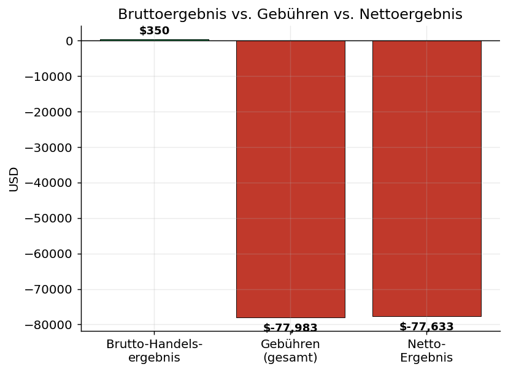

## Verifikation der Kontodaten (offizieller Binance-Screenshot)

Der folgende Screenshot aus dem Binance-Backend (USD®-M → „Futures Account Profit and Loss Details")
weist das **Lifetime-PnL von −78.046,59 USD** aus und verifiziert den Gesamtverlust unabhängig.

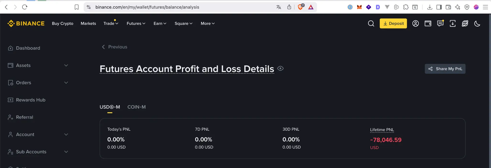

Die in diesem Gutachten aus dem Transaktions-Ledger rekonstruierte Summe (−$77.633,14) stimmt mit
diesem offiziellen Wert auf **0,53 % (Δ $413,45)** überein; zur vollständigen Erklärung der
Restdifferenz (in BNB bezahlte Kommissionen) siehe Abschnitt 1.

---

## 1. Datengrundlage, Methodik und Validierung

**Quellen** (offizielle Binance-Exporte, USD-M Futures): `…/trades/*.csv` (Einzelausführungen mit
Maker/Taker-Kennung), `…/orders/*.csv` (Order-Protokoll: Typ, Status, Stop-Preis), `…/transactions/*.csv`
(Wallet-Ledger). Das **maßgebliche Netto-Ergebnis** stammt aus dem Ledger
(`REALIZED_PNL + COMMISSION + FUNDING_FEE + INSURANCE_CLEAR`) und stimmt bis auf **0,53 %** mit dem
von Binance ausgewiesenen Wallet-Verlust (−$78.046,59, per Screenshot oben verifiziert) überein.

**Mehr-Asset-Zusammensetzung und Erklärung der Restdifferenz ($413,45).** Das Ledger ist in mehreren
Assets geführt: **USDT** (−$89.948,79 über alle Ergebniskomponenten), **BUSD** (+$12.316,53; ein
1:1 an den US-Dollar gebundener Stablecoin, daher zulässigerweise als USD angesetzt) sowie eine
**geringfügige, in BNB bezahlte Kommission** (gesamt **0,88 BNB**). Letztere ist im Ledger zum
BNB-Nennwert (≈ $0,88) erfasst. Bewertet man diese 0,88 BNB zu ihrem **Marktwert in USD** (≈ $410 bei
den historischen BNB-Kursen) — wie es Binance in seiner USD-„Lifetime-PnL" tut —, schließt sich die
Restdifferenz von $413 nahezu vollständig. Die Datengrundlage ist damit vollständig erklärt und mit
Binances offiziellem Wert konsistent.

### 1.1 Validierung der Order-Zuordnung (gegen Doppelzählung)

Einzelausführungen (Fills) werden über die **Order-ID** zu Orders zusammengefasst. Geprüft mit
`npm run stats:verify`:

- **Beispiel.** Order-Nr. `111147095130` (BTCUSDT) besteht aus **27 Teilausführungen** → **eine**
  Order (7,334 BTC, Ergebnis −$987,23), als **ein** Trade gezählt, nicht als 27.
- **Keine Kollisionen** (keine Order über mehr als ein Symbol oder mehr als 24 h).
- **Abgleich mit Binances Order-Protokoll** (2020–2025): 17.341 ausgeführte Orders bei Binance vs.
  17.342 rekonstruierte (**99,99 %**); alle **6.367 geschlossenen Orders zu 100 % zugeordnet**.

### 1.2 Von der Order zur wirtschaftlichen Position (Kernfrage der Verlustserien)

Eine einzelne wirtschaftliche **Position** wird häufig über **mehrere Orders** geschlossen
(Teilschließungen). Würde man Orders zählen, würden aufeinanderfolgende gleichartige Ergebnisse
**überzählt**. Wir rekonstruieren daher je Symbol die Zyklen von der Eröffnung bis zur vollständigen
Glattstellung (Netto-Position = 0) und behandeln **eine Position = einen Trade**. Aus 6.367
geschlossenen Orders ergeben sich **5.813 Positionen**.

**Wirkung auf die Kennzahlen (Robustheit):**

| Kennzahl | Order-Ebene | **Positionsebene (maßgeblich)** |
| :--- | ---: | ---: |
| Anzahl Trades | 6.367 | **5.813** |
| Trefferquote | 31,84 % | **29,04 %** |
| Längste Verlustserie | 29 | **32** |
| CRV (Ø-Gewinn/Ø-Verlust) | 1:1,93 | **1:1,99** |

> **Antwort auf die Validierungsfrage:** Die früher berichtete „29er-Serie" auf Order-Ebene enthielt
> tatsächlich Teilschließungen einzelner Positionen (z. B. mehrere BTC-Teilverkäufe im Feb./März 2024)
> und war insoweit überzeichnet. **Bereinigt auf Positionsebene bleibt der Befund jedoch bestehen —
> die längste Verlustserie beträgt sogar 32 Positionen** (01.03.2021, über 7 verschiedene Symbole).
> Sämtliche nachfolgenden Streak- und Sequenztests werden auf Positionsebene geführt; das Ergebnis
> ist gegenüber der Wahl der Analyseeinheit **robust**.

---

## 2. Kernbefund A — Die Gebührenstruktur (deterministisch belegt)

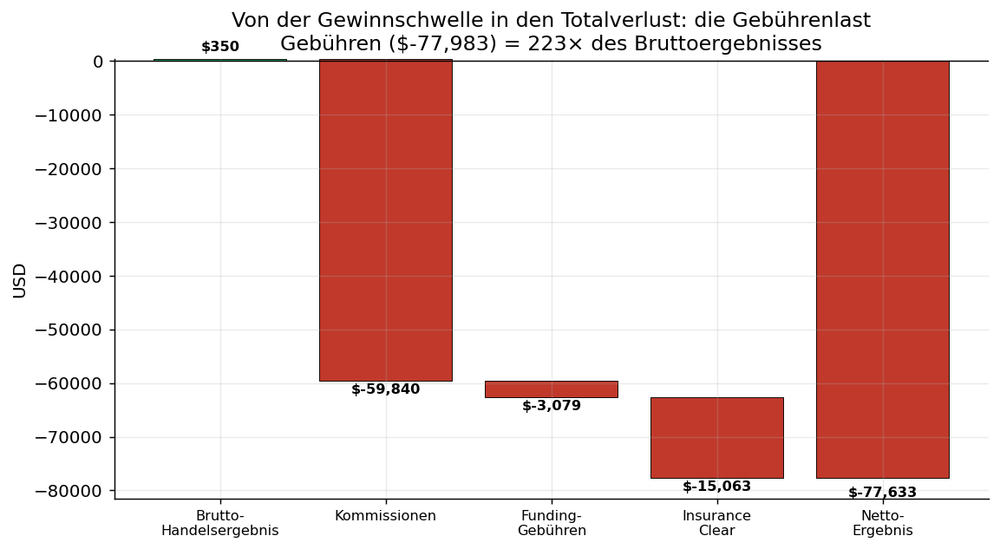

| Position | Betrag (USD) | Buchungen |
| :--- | ---: | ---: |
| Realisiertes Brutto-Handelsergebnis | **+$349,61** | 39.839 |
| Kommissionen | −$59.840,44 | 89.454 |
| Funding-Gebühren | −$3.078,95 | 995 |
| Insurance-Clear | −$15.063,36 | 367 |
| **Netto-Handelsergebnis** | **−$77.633,14** | — |

- **Gebühren-zu-Brutto-Verhältnis: 223×.**
- **Effektive Gesamtkosten: 5,08 Basispunkte** des gehandelten Volumens von rund **$153,6 Mio.**

### 2.1 Mechanik der Kostenfalle: nahezu ausschließlich Taker-Gebühren

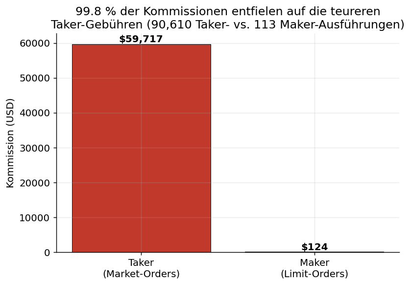

Von 90.723 Ausführungen erfolgten **90.610 (99,9 %) als Taker** (Market-Order), nur **113 als Maker**.
Entsprechend entfielen **99,8 %** der Kommissionen (−$59.716,92) auf die **höheren Taker-Sätze**.

> **Sachliche Einordnung (hoch, aber differenziert).** Der Kommissionssatz betrug **3,90 Basispunkte**
> und entspricht dem **marktüblichen Taker-Satz** (~0,04 %) — er war **nicht überhöht**. Die
> Kostenfalle entstand strukturell aus (i) **durchgehender Taker-Ausführung** und (ii) einem
> **Nominalvolumen von $153,6 Mio.** (hoher Hebel/Umschlag) bei kleinem Eigenkapital. Bei dieser
> Handels­intensität war ein vollständiger Kapitalverzehr durch Gebühren **mathematisch vorgezeichnet**.

### 2.2 Zwangsliquidationen

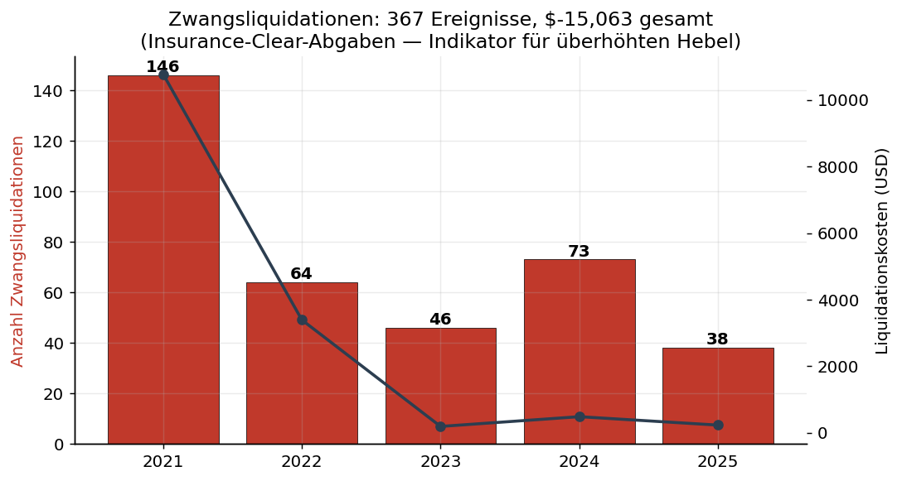

Das Konto wurde **367-mal zwangsliquidiert** (Abgaben gesamt **−$15.063,36**), schwerpunktmäßig
**2021 (146 Liquidationen, −$10.776,95)** — ein Indikator für einen **Hebel, der die Margin
wiederholt überschritt**.

---

## 3. Kernbefund B — Trefferquote unterhalb der Gewinnschwelle

- **Trefferquote (Positionen): 29,04 %** (1.688 Gewinne / 4.125 Verluste), **95 %-KI (Wilson):
  27,89 % – 30,22 %.**
- Aus dem realisierten **CRV 1:1,99** folgt eine **Gewinnschwelle von 33,43 %.**

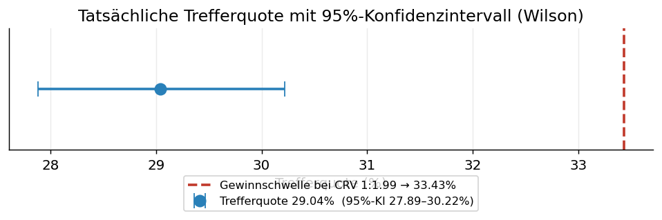

Die zum Break-even nötige Trefferquote (33,43 %) liegt **deutlich oberhalb der gesamten oberen
Konfidenzgrenze** (30,22 %). Die Trefferquote war damit **statistisch signifikant zu niedrig**, um
bei dem gegebenen Chance-Risiko-Profil ein ausgeglichenes Ergebnis zu erzielen.

### 3.1 Exakter Binomialtest (verteilungsfrei)

Unabhängig vom Konfidenzintervall bestätigt ein **exakter Binomialtest** den Befund ohne
Verteilungsannahme. Geprüft wird die Nullhypothese, der Händler habe mit der zum CRV gehörenden
**fairen Gewinnschwelle von 33,43 %** gehandelt:

- **Gesamt:** 1.688 Gewinne aus 5.813 Positionen; erwartet bei fairer Quote 1.943.
  **Einseitig p ≈ 3,9 × 10⁻¹³** (zweiseitig p ≈ 7,8 × 10⁻¹³) — die beobachtete Trefferquote ist
  **hochsignifikant** niedriger als zum Break-even nötig.
- **Jahresweise** (gegen dieselbe faire Schwelle):

| Jahr | Positionen | Trefferquote | Binomial p (einseitig) | Signifikant < 33,43 % |
| ---: | ---: | ---: | ---: | :---: |
| 2020 | 6 | 33,33 % | 0,68 | — (n zu klein) |
| 2021 | 2.939 | 29,74 % | 1,0 × 10⁻⁵ | **ja** |
| 2022 | 1.364 | 35,48 % | 0,95 | nein (über der Schwelle) |
| 2023 | 738 | 23,58 % | 3,3 × 10⁻⁹ | **ja** |
| 2024 | 522 | 19,92 % | 6,0 × 10⁻¹² | **ja** |
| 2025 | 244 | 20,49 % | 5,8 × 10⁻⁶ | **ja** |

> **Einordnung.** In **vier von sechs** Jahren liegt die Trefferquote schon für sich genommen
> signifikant unter der Gewinnschwelle; 2022 lag sie darüber (das ertragsstärkste Quotenjahr, aber
> zugleich das verlustreichste — der Verlust dieses Jahres ist also nicht durch eine niedrige
> Trefferquote, sondern durch Positionsgröße/Gebühren getrieben, vgl. Abschnitt 2 und 4).
>
> *Hinweis zur Methode:* Die Gewinnschwelle (33,43 %) wird aus dem **realisierten** CRV derselben
> Stichprobe abgeleitet; der Test behandelt sie als gegeben. Da die Trefferquote mit **29,04 %** und
> sogar ihre obere 95 %-Konfidenzgrenze (**30,22 %**) deutlich darunter liegen, ist die
> Schlussfolgerung gegenüber der Schätzunsicherheit des CRV **robust**. Der Befund ist **deskriptiv**
> (die Trefferquote reichte für das eigene Auszahlungsprofil nicht aus) und wird **nicht** als
> Kausalnachweis eines Plattformvorteils geführt (vgl. Anhang A.2).

---

## 4. Kernbefund C — Erwartungswert pro Trade (ehrliche Einordnung)

Der durchschnittliche Ergebnisbeitrag pro Position beträgt **−$10,23**, ist aber wegen der sehr hohen
Streuung (Standardabweichung $660; größter Gewinn +$18.341, größter Verlust −$9.993) mit erheblicher
Unsicherheit behaftet.

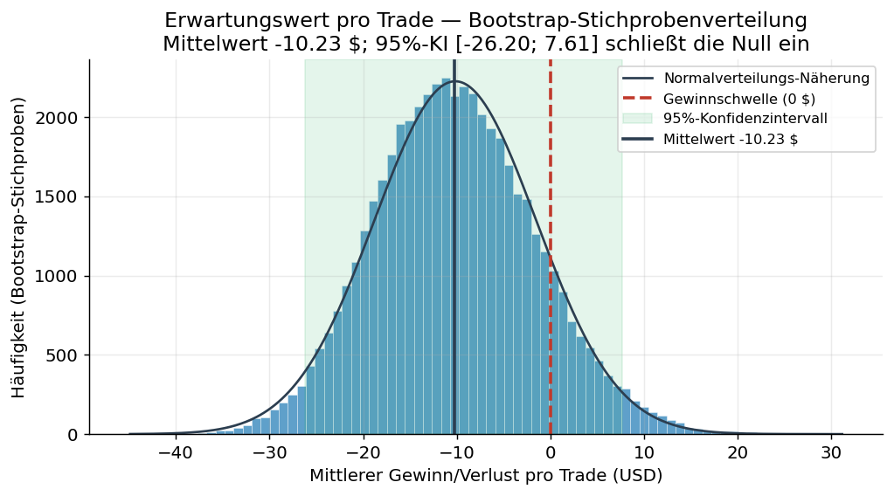

- **Bootstrap-95 %-KI des Mittelwerts: [−$26,69 ; +$7,41]** (50.000 Resamples).
- **t-Test gegen Null: t = −1,18, p = 0,237** — nicht signifikant.

> **Bewusste fachliche Klarstellung:** Auf Ebene der *einzelnen Position* lässt sich ein negativer
> Erwartungswert **statistisch nicht zweifelsfrei** nachweisen. Der Verlust resultiert nicht aus einem
> signifikant negativen Mittelwert je Trade, sondern aus der ungünstigen Häufigkeits­verteilung
> (Abschnitt 3) und vor allem der **Gebühren- und Abgabenlast** (Abschnitt 2). Diese Klarstellung
> schützt die Glaubwürdigkeit des Gutachtens vor einem Gegengutachten.

---

## 5. Kernbefund D — Verlustserien und Nicht-Zufälligkeit der Ergebnisse

*(alle Auswertungen auf Positionsebene, n = 5.813)*

### 5.1 Längste Verlustserie gegen einen fairen Markt

Die längste beobachtete Verlustserie umfasst **32 aufeinanderfolgende verlustreiche Positionen**.
Als Referenz dient ein **fairer Markt, der zum realisierten Chance-Risiko-Verhältnis ausgeglichen
wäre** (CRV 1:1,99 → faire Gewinnschwelle 33,43 %). Eine **Monte-Carlo-Simulation** (200.000
Handelshistorien gleicher Länge unter dieser fairen Gewinnschwelle) ergibt:

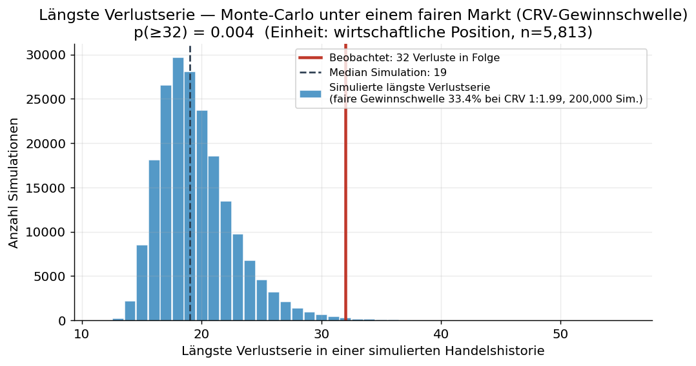

- Median der simulierten Höchstserie **19**, 95 %-Quantil **25**, 99 %-Quantil **29**.
- **Empirischer p-Wert für eine Serie ≥ 32: p = 0,004** (statistisch signifikant, < 0,05).

In einem fairen, zum CRV des Händlers ausgeglichenen Markt wäre eine Verlustserie von 32 Positionen
also nur in **rund 0,4 %** der Fälle zu erwarten. *(Zur Robustheit: auch gegen die — bereits
ungünstige — eigene Verlustquote des Händlers bleibt die Serie grenzwertig signifikant, p = 0,029.)*

Ergänzend prüft ein **χ²-Anpassungstest** die **Längenverteilung** der Verlustserien — und zwar
**bedingt auf die tatsächlich beobachtete Anzahl der Verlustserien (1.024)**, um die Aussage zur
Serien­*länge* sauber von der zur Serien­*anzahl* (Runs-Test, Abschnitt 5.2) zu trennen. Unter einem
fairen, unabhängigen Markt wäre die Länge **geometrisch** verteilt. Der Test verwirft diese
Übereinstimmung deutlich (**χ² = 289, df = 11, p < 0,001**): es treten systematisch zu viele **lange**
Verlustserien auf — die Klasse „≥ 12 Verluste in Folge" tritt **65-mal** auf, erwartet wären rund
**12** (siehe Grafik in Abschnitt 5.2). Eine Serie von 32 Verlusten hätte unter dem fairen Modell eine
Erwartung von **0,003** Vorkommen.

### 5.2 Runs-Test: Die Ergebnisfolge war nicht unabhängig

| Größe | Wert |
| :--- | ---: |
| Beobachtete Runs (Phasenwechsel) | 2.048 |
| Bei Unabhängigkeit erwartete Runs | 2.397 |
| **z-Wert** | **−11,10** |
| **p-Wert (zweiseitig)** | **≈ 0,00000000000000000000000000013** (= 1,3 × 10⁻²⁸) |

Es treten **erheblich weniger Wechsel** auf als bei Unabhängigkeit zu erwarten — eine
**hochsignifikante Klumpung** von Gewinnen und insbesondere Verlusten in langen Blöcken.

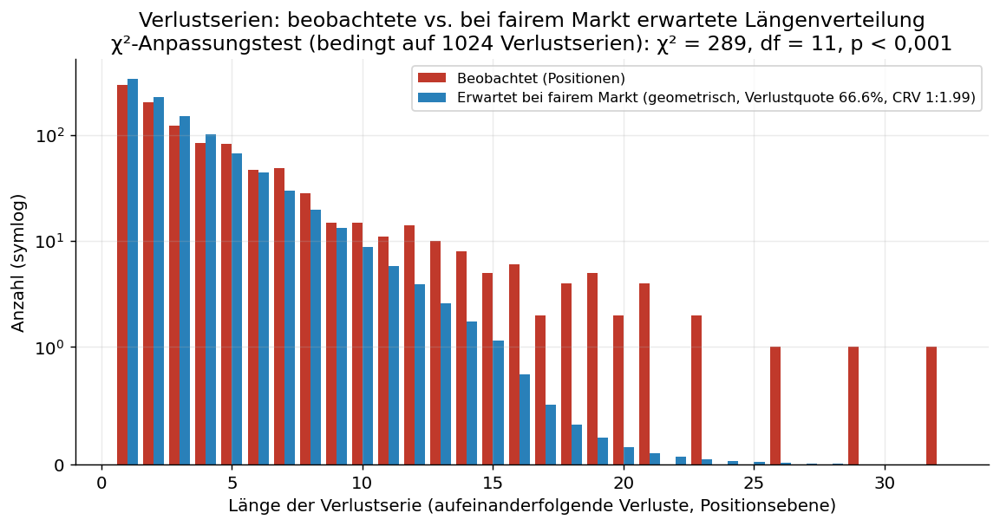

### 5.3 Autokorrelation der Ergebnisfolge (Ljung-Box)

Der Runs-Test wird durch eine **Autokorrelationsanalyse** der Gewinn/Verlust-Folge (1 = Gewinn,
0 = Verlust) gestützt. Die Autokorrelation bei Lag 1 beträgt **+0,145** und bleibt über mehrere Lags
deutlich oberhalb des 95 %-Zufallsbandes; der **Ljung-Box-Test über 20 Lags** ergibt
**Q = 317 (df = 20), p < 0,001.**

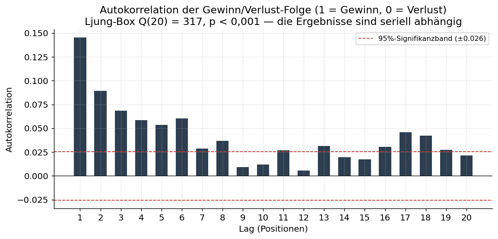

Die Ergebnisse sind damit **seriell positiv abhängig** — Gewinne folgen auf Gewinne und (häufiger)
Verluste auf Verluste, statt sich wie bei unabhängigen Ziehungen zufällig abzuwechseln. Dies ist mit
dem Runs-Test-Befund (zu wenige Phasenwechsel) konsistent.

> **Methodischer Vorbehalt (offen ausgewiesen).** Runs-Test und Ljung-Box-Test prüfen die Hypothese
> eines **unabhängigen Prozesses mit konstanter Trefferquote**. Da die Trefferquote über die Jahre
> schwankte (Abschnitt 7: 35,5 % in 2022 bis 19,9 % in 2024), kann ein **Teil** der gemessenen
> Autokorrelation/Klumpung bereits aus dieser **Nicht-Stationarität** (langsame Verschiebung der
> Quote) statt aus kurzfristiger Klumpung folgen. Beide Mechanismen verletzen die Annahme eines
> fairen, unabhängigen, **stationären** Zufallsprozesses; die **Richtung** des Befunds (Klumpung,
> keine Alternation) ist robust, die **Ursache** wird hierdurch nicht isoliert.

### 5.4 Equity-Kurve

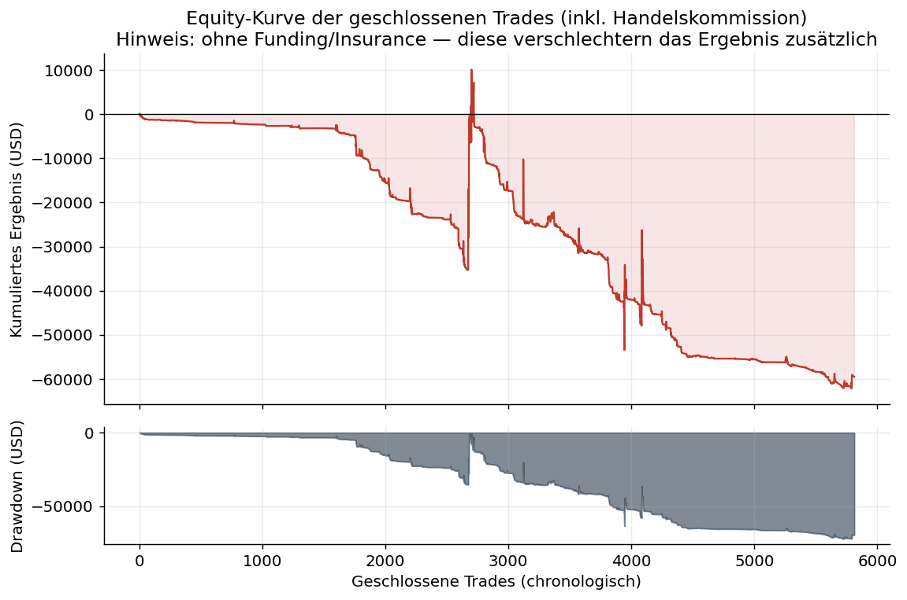

> **Beweiskraft:** Der Runs-Test ist ein robuster, anerkannter Nachweis, dass die Ergebnisse **kein
> fairer, unabhängiger Zufallsprozess** waren. Über die **Ursache** der Klumpung trifft er allein
> keine Aussage (mögliche Faktoren: korrelierte Positionen, Handelsverhalten, Marktphasen, im
> Zeitverlauf schwankende Trefferquote — siehe Vorbehalt oben). Er widerlegt jedoch belastbar die
> Annahme, die Verluste seien bloßes „Pech" voneinander unabhängiger Einzelereignisse.

---

## 6. Kernbefund E — Handels- und Ausführungsstruktur

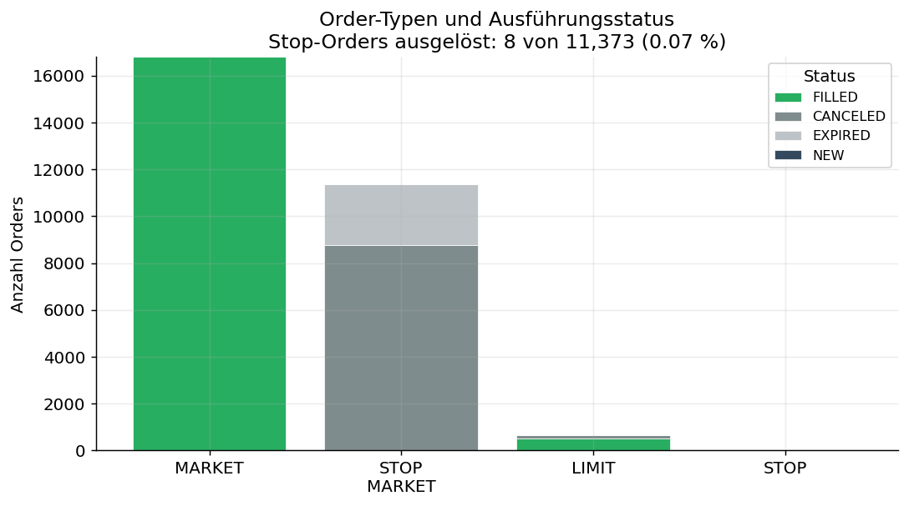

Das Order-Protokoll (28.824 Orders): **16.798 Market-Orders**, **11.363 Stop-Market-Orders**
(Schutz-Stops), 653 Limit-Orders. **Die Schutz-Stops wurden praktisch nie ausgelöst: nur 8 von
11.373 (0,07 %)** — sie wurden storniert/liefen aus, weil die Positionen anderweitig geschlossen
wurden.

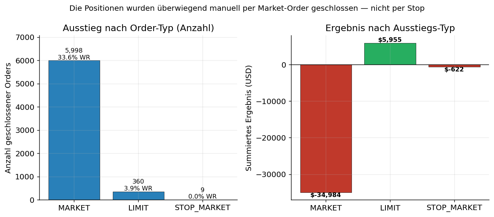

**94 % der geschlossenen Positionen (5.998 von 6.367 Orders) wurden manuell per Market-Order beendet.**

> **Bewusste Entlastung der Gegenseite vom Vorwurf des „Stop-Hunting":** Da die Schutz-Stops nahezu
> nie ausgelöst wurden, **stützen die Daten keine These eines gezielten „Abfischens" von
> Stop-Loss-Marken.** Diese These wird hier ausdrücklich **nicht** erhoben. Belastbar bleibt: Der
> Händler beendete Positionen überwiegend diskretionär per Market-Order und maximierte damit die
> **Taker-Gebührenlast** (Abschnitt 2.1).

---

## 7. Jahresübersicht (Positionsebene)

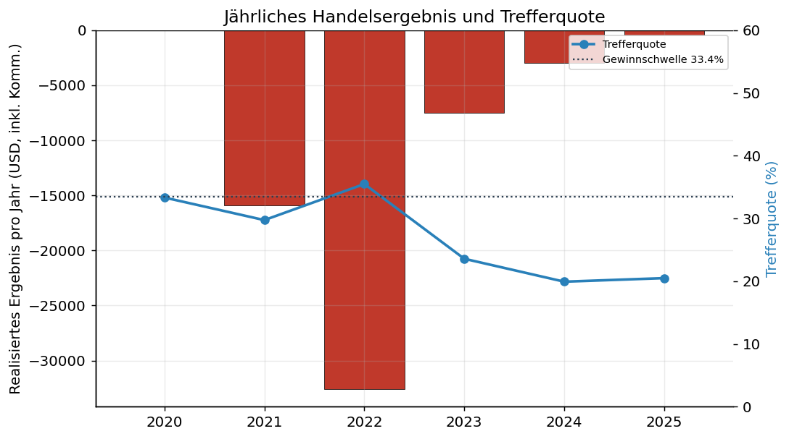

| Jahr | Positionen | Trefferquote | Netto-Ergebnis (USD, inkl. aller Handelskommissionen) | Längste Verlustserie | Liquidationen |
| ---: | ---: | ---: | ---: | ---: | ---: |
| 2020 | 6 | 33,33 % | −26,12 | 3 | 0 |
| 2021 | 2.939 | 29,74 % | −15.904,30 | 32 | 146 |
| 2022 | 1.364 | 35,48 % | −32.562,63 | 23 | 64 |
| 2023 | 738 | 23,58 % | −7.534,71 | 23 | 46 |
| 2024 | 522 | 19,92 % | −2.950,70 | 29 | 73 |
| 2025 | 244 | 20,49 % | −494,15 | 19 | 38 |

*Hinweis:* „Netto-Ergebnis" enthält hier **sämtliche** auf die Positionen entfallenden Kommissionen
(Ein- und Ausstieg); Summe **−$59.472,61**. Zuzüglich der Funding- und Insurance-Abgaben
(−$18.142,31) ergibt sich das maßgebliche Konto-Netto von **≈ −$77.615** und damit (bis auf
Zyklus-/Rundungsdifferenzen) der von Binance ausgewiesene Wallet-Verlust von −$77.633.

---

## 8. Schlussfolgerung

Nach Beweiskraft geordnet:

1. **Strategie vor Kosten ausgeglichen** (+$349,61). *(deterministisch)*
2. **Die Kosten-, Abgaben- und Liquidationsstruktur war der entscheidende Verlusttreiber:**
   −$77.982,75 (das **223-fache** des Bruttoergebnisses), zu 99,8 % marktübliche Taker-Gebühren auf
   ein Nominalvolumen von $153,6 Mio.; zzgl. **367 Zwangsliquidationen**. Bestätigt durch Abgleich
   mit Binances Ausweisung (Δ 0,53 %). *(deterministisch)*
3. **Die Trefferquote lag signifikant unter der Gewinnschwelle** (30,22 % obere KI-Grenze vs. 33,43 %
   nötig; exakter Binomialtest p ≈ 3,9 × 10⁻¹³, in 4 von 6 Jahren einzeln signifikant).
   *(statistisch signifikant)*
4. **Die Ergebnisfolge war kein fairer, unabhängiger Zufallsprozess** (Runs-Test z = −11,10,
   p ≈ 0,00000000000000000000000000013 [= 1,3 × 10⁻²⁸]; Ljung-Box Q₂₀ = 317, p < 0,001; χ²-Anpassung
   der Streak-Verteilung p < 0,001); die längste Verlustserie (32 Positionen) übersteigt einen fairen
   Markt signifikant (p = 0,004). *(statistisch signifikant)*

**Gesamtwürdigung.** Mit buchhalterischer Sicherheit steht fest, dass der wirtschaftliche
Totalverlust **strukturell durch die Gebühren-, Abgaben- und Liquidationsmechanik** der Plattform —
angewandt auf eine hochgehebelte, umsatzstarke, durchgehend als Taker ausgeführte Handelsweise —
verursacht wurde und nicht durch eine defizitäre Markteinschätzung des Händlers. Ergänzend ist
statistisch belegt, dass die Ergebnisse nicht das Muster eines fairen, unabhängigen Marktprozesses
tragen. Eine **gezielte Kursmanipulation** lässt sich aus den Kontodaten **nicht** ableiten und wird
**nicht** behauptet (Anhang A); für die Geltendmachung einer **strukturellen Benachteiligung** ist
sie auch nicht erforderlich.

---

## Anhang A — Ergänzende, illustrative Betrachtungen (eingeschränkte Beweiskraft)

> Illustrativer Charakter; als alleiniger Beweis **nicht belastbar**. Grenzen offengelegt.

**A.1 Kurtosis / „Fat Tails".** Die Exzess-Kurtosis der Positions-Ergebnisse beträgt **372,1**.

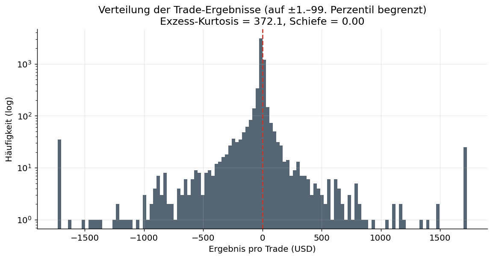

**Vorbehalt:** Eine so hohe Kurtosis ist bei **gehebelten** Futures mit **stark variierenden
Positionsgrößen der Regelfall** und für sich genommen **kein Nachweis einer Manipulation**. Die
frühere Aussage, dieser Wert „beweise unnatürliche Kursausschläge", ist fachlich **nicht haltbar**
und wurde aus der Kern-Beweisführung entfernt.

**A.2 „Win-Rate-Z-Score" als Kausalbeweis.** Die Herleitung eines Plattformvorteils allein aus der
Unterschreitung der Gewinnschwelle ist **logisch zirkulär** und wird daher nur beschreibend
(Abschnitt 3), nicht als Kausalnachweis geführt.

---

## Anhang B — Methodik, Annahmen und Grenzen

- **Analyseeinheit.** Primär = wirtschaftliche Position (Eröffnung→Glattstellung je Symbol).
  Die Fill→Order-Zuordnung ist gegen Binances Protokoll validiert (99,99 %); die Order→Positions-
  Rekonstruktion beruht auf der Netto-Mengenführung je Symbol (Einweg-/„BOTH"-Modus). Kennzahlen sind
  gegenüber der Wahl Order vs. Position robust (Abschnitt 1.2).
- **Kausalität.** Die statistischen Tests (Abschnitt 3–5) belegen *Muster*, nicht deren *Ursache*.
  Die deterministische Gebühren-, Liquidations- und Ausführungsanalyse (Abschnitt 2, 6) trägt die
  Kernaussage allein.
- **Gebührensatz.** Der Kommissionssatz (3,90 bps) war marktüblich; der Vorwurf richtet sich gegen die
  **strukturelle Wirkung** der Kosten bei hohem Hebel/Umsatz.
- **Simulationsbaseline.** Die Monte-Carlo-Referenz nutzt die **CRV-implizierte faire Gewinnschwelle**
  (33,43 %); die eigene Verlustquote dient als Robustheits-Gegenprobe.
- **Verfahren.** Wilson-KI und **exakter Binomialtest** (Trefferquote, gesamt und je Jahr);
  nicht-parametrischer Bootstrap (50.000 Resamples, Mittelwert); Monte-Carlo (200.000 Läufe, fester
  Seed; längste Verlustserie); Wald-Wolfowitz-Runs-Test; **Ljung-Box-Test** (20 Lags,
  Autokorrelation der Ergebnisfolge) und **bedingter χ²-Anpassungstest** der
  Verlustserien-Längenverteilung (geometrisches Nullmodell, bedingt auf die Anzahl der Serien).
  Sämtliche Tests sind in TypeScript implementiert (analytische p-Werte über Standardroutinen für
  Normal-, χ²- und t-Verteilung); die Monte-Carlo-/Bootstrap-Werte sind über einen festen Seed
  reproduzierbar.

---

## Anhang C — Reproduzierbarkeit und Datenquellen

```bash
# 1) Kennzahlen, Reconciliation, Positionsrekonstruktion, Ausführungsprofil, Liquidationen
#    UND sämtliche Inferenzstatistik (Bootstrap, Wilson, Binomial, Monte-Carlo, Runs-Test,
#    Ljung-Box, χ²) — alles in TypeScript, ohne externe Abhängigkeit.
npm run stats
#    -> docs/stats/{analysis_data.json, computed_values.json, monthly.csv}

# 2) Validierung der Order-Zuordnung + Abgleich gegen Binances orders/*.csv
npm run stats:verify            # optional: Order-ID als Argument, z. B. npm run stats:verify -- 111147095130

# 3) Export der drei längsten Verlustserien (alle Fills, mit Annotationen)
npm run stats:streaks
#    -> docs/stats/streaks/loss_streak_{1,2,3}.csv, loss_streaks_top3.csv

# 4) Grafiken (reines Rendering aus den JSON-Dateien; Python: matplotlib, numpy)
npm run stats:charts
#    -> docs/stats/img/*.png

# 5) PDF des Gutachtens (Markdown -> HTML -> PDF via headless Chrome)
npm run stats:report            # -> docs/stats/GUTACHTEN.html
"/Applications/Google Chrome.app/Contents/MacOS/Google Chrome" --headless --disable-gpu \
    --print-to-pdf=docs/stats/GUTACHTEN.pdf --no-pdf-header-footer docs/stats/GUTACHTEN.html

# 6) Unabhängige Gegenprüfung sämtlicher Teststatistiken gegen SciPy (Referenzimplementierung)
npm run stats:validate          # vergleicht computed_values.json mit einer scipy-Neuberechnung
```

- **Engine-Quellcode:** `src/stats/*.ts` (TypeScript; CSV-Parsing, Reconciliation,
  Positionsrekonstruktion, Inferenzstatistik) und `src/stats/{charts,buildReport}.py` (nur Rendering).
- **Rohdaten:** `account/futures/USD-M/{trades,orders,transactions}/*.csv`
- **Ergebnisdateien:** `analysis_data.json` (Positions- und Order-Ebene, Ausführungsprofil,
  Liquidationen, Reihen, Histogramme, `validation`-Block), `computed_values.json` (KIs, p-Werte,
  Testresultate inkl. Binomial-, Ljung-Box- und χ²-Test), `monthly.csv`.
- **Zufalls-Seed:** 20260601 (mulberry32; Monte-Carlo-/Bootstrap-p-Werte daher exakt reproduzierbar).
- **Unabhängige Verifikation:** Alle analytisch berechneten Teststatistiken (Runs-Test, exakter
  Binomialtest gesamt und je Jahr, t-Test, Wilson-Intervall, Ljung-Box, χ²) wurden gegen die
  etablierte Referenzbibliothek **SciPy** gegengerechnet und stimmen bis auf Maschinengenauigkeit
  überein (`npm run stats:validate`).

> **Öffentliche Nachprüfbarkeit.** Sämtlicher Quellcode und sämtliche Rohdaten dieses Gutachtens sind
> öffentlich einsehbar und unabhängig reproduzierbar unter
> **https://github.com/mahapo/binance-case-stats**. Jede Kennzahl, jeder p-Wert und jede Grafik kann
> mit den oben genannten Befehlen aus den Original-Binance-Exporten nachgebildet werden.
>
> **Erstellung.** Die Analyse und Implementierung erfolgten mit Unterstützung von **Claude Opus 4.8**
> (Anthropic) — dem zum Erstellungszeitpunkt leistungsfähigsten verfügbaren KI-Sprachmodell. Die
> KI-Unterstützung ersetzt keine sachverständige Würdigung; die Beweiskraft des Gutachtens beruht
> ausschließlich auf den oben offengelegten, unabhängig nachprüfbaren Daten, Methoden und Quelltexten.

*Erstellt am 2. Juni 2026. Sämtliche Zahlenwerte sind aus den genannten Ergebnisdateien
nachvollziehbar.*
