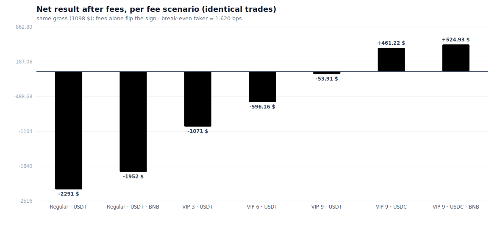
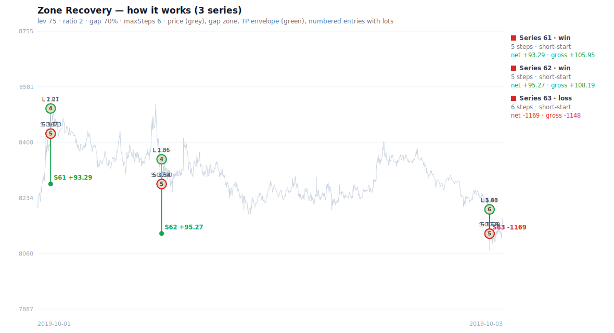
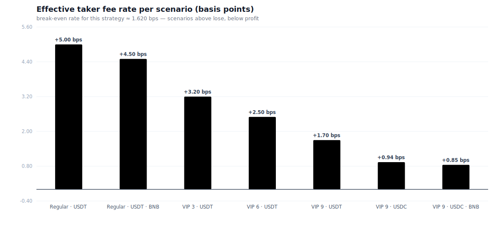
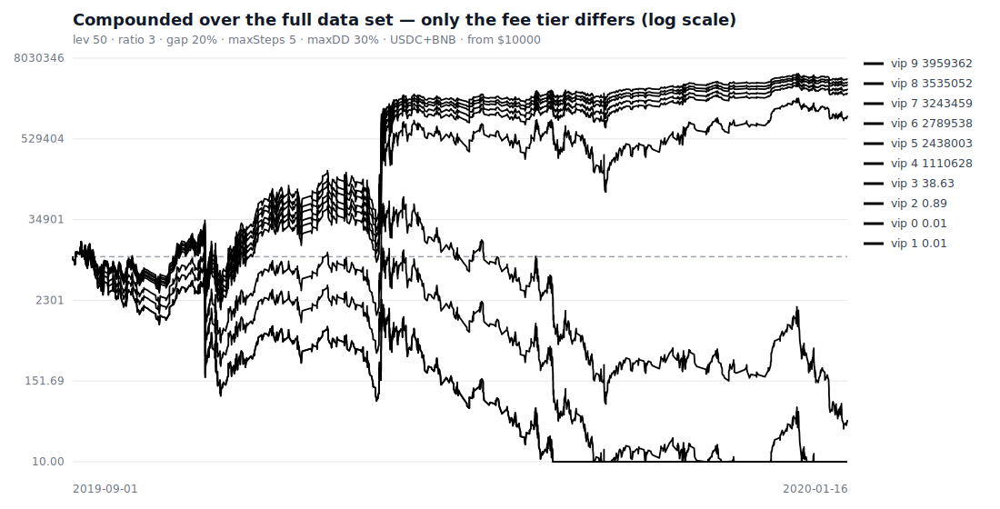
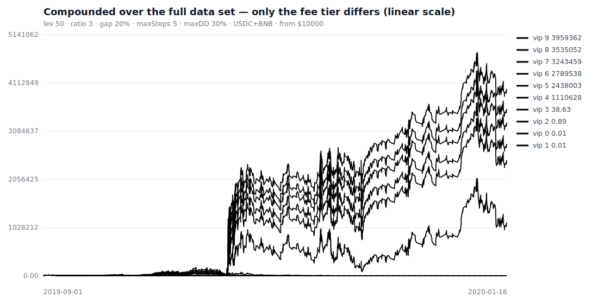

# Gutachten: Strukturelle Gebühren-Benachteiligung am Beispiel der Zone-Recovery-Strategie

**Datum:** 3. Juni 2026
**Produkt:** Binance Futures USDⓈ-M (USDT-/USDC-margined Perpetuals)
**Datengrundlage:** Realer Binance-Tick-Export `Gemini_BTCUSD_tradeprints_Q4_2019.csv` — **765.528
Einzeltrades** (vollständige Datei, Q4 2019).
**Gegenstand:** Simulativer, reproduzierbarer Nachweis, dass bei **identischer Handelsabfolge allein
die Gebührenstufe** (VIP-Level, BNB-Rabatt, Quote-Asset) über Gewinn oder Verlust entscheidet —
**unabhängig von der Marktrichtung**.
**Methodengrundlage:** Das Handels-/Gebührenmodell (`src/models/`) ist gegen die offiziellen
Binance-Kontoexporte zur **8. Nachkommastelle** validiert (Abschnitt 6; Schwester-Gutachten
[`docs/stats/GUTACHTEN.md`](../stats/GUTACHTEN.md)).
**Hintergrund:** Untersucht wird die *Zone-Recovery-/Hedging-Strategie* (CAP Zone Recovery EA PRO),
die der Geschädigte 2021 als Handels-Bot („Moneyprinter") betrieb.

> **Methodischer Grundsatz.** Strikte Trennung zwischen (a) **deterministisch belegbaren Tatsachen**
> (Gebührenformel, Identität des Bruttoergebnisses über alle Gebührenstufen, rechnerische
> Gewinnschwelle) und (b) **simulativen Befunden** (konkrete Netto-Ergebnisse, Richtungs­unabhängigkeit,
> Zinseszins-Wirkung). Jede Zahl ist mit `npm run report` aus den beigefügten Rohdaten reproduzierbar
> (Anhang A). Die deterministischen Kernaussagen (Abschnitt 3.1) sind daten- und richtungsunabhängig.

---

## 0. Zusammenfassung (Executive Summary)

Eine **Zufalls-Handelsstrategie** (zufällig Long/Short, danach regelbasierte Zone-Recovery-Absicherung)
wurde auf der **vollständigen** realen Tickdatei (BTC, Q4 2019; 765.528 Trades) simuliert. Dieselbe,
**zeichengenau identische Handelsabfolge** (fester Zufalls-Seed, feste Positionsgröße, **4.046
abgeschlossene Serien**) wurde durch **sieben reale Gebührenszenarien** geschickt.

| Gebührenszenario | Taker-Satz | Gebühren | **Netto-Ergebnis** | Beweiskraft |
| :--- | ---: | ---: | ---: | :--- |
| **Regular · USDT** | 5,000 bps | $3.389,01 | **−$2.290,66** | deterministisch |
| Regular · USDT · BNB | 4,500 bps | $3.050,11 | −$1.951,76 | deterministisch |
| VIP 3 · USDT | 3,200 bps | $2.168,97 | −$1.070,62 | deterministisch |
| VIP 6 · USDT | 2,500 bps | $1.694,50 | −$596,16 | deterministisch |
| VIP 9 · USDT | 1,700 bps | $1.152,26 | −$53,91 | deterministisch |
| VIP 9 · USDC | 0,940 bps | $637,13 | **+$461,22** | deterministisch |
| **VIP 9 · USDC · BNB** | 0,846 bps | $573,42 | **+$524,93** | deterministisch |

**Bruttoergebnis (vor Gebühren): +$1.098,35 — in allen sieben Szenarien identisch (Streuung = 0).**

**Kernaussagen — deterministisch belegt:**

1. Das **Bruttoergebnis ist über alle Gebührenstufen exakt gleich** (+$1.098,35; Streuung 0). Die
   Trades sind dieselben; **die einzige Variable ist die Gebühr** (Abschnitt 3, Abb. 2).
2. **Allein die Gebühr kehrt das Vorzeichen um:** ein **Regular User verliert $2.290,66**, ein
   **VIP 9 mit BNB-Rabatt in USDC gewinnt $524,93** — bei **denselben** Geschäften.
3. Die **rechnerische Gewinnschwelle** liegt bei **1,620 bps** (= Brutto / Handelsvolumen $6.778.019).
   Jede Stufe **darüber** verliert zwangsläufig, jede **darunter** gewinnt. Der Regular-Satz
   (**5,000 bps**) liegt **gut das Dreifache** über der Schwelle — der Verlust ist **strukturell
   garantiert**, nicht markt- oder handlungsabhängig.

**Kernaussage — Richtungsunabhängigkeit (24 Zufalls-Seeds):**

4. Über **24 unabhängige Zufalls-Long/Short-Folgen** verlor der **Regular User 24 von 24 Mal**
   (Mittel −$2.237,90), der **VIP 9 · USDC · BNB gewann 24 von 24 Mal** (Mittel +$594,40). **Die
   Marktrichtung ist irrelevant; die Gebührenstufe ist es nicht** (Abschnitt 5).

**Kernaussage — Zinseszins-Wirkung über die volle Datei (saldenbasierte Größe):**

5. Lässt man dieselbe Strategie über die **gesamte Datei zinseszinslich** laufen (Größe aus dem
   laufenden Saldo, $10.000 Start), wird der Effekt extrem: **die teuren Stufen werden vollständig
   ausgelöscht, die billigen vervielfachen das Kapital** — bei identischer Handelslogik (Abschnitt 4):

   | Fee-Tier (USDC+BNB) | Endsaldo aus $10.000 |
   | :--- | ---: |
   | VIP 0 (Regular) | **$0,01** (Totalverlust) |
   | VIP 3 | $38,63 |
   | VIP 4 | $1.110.628 |
   | **VIP 9** | **$3.959.362** |



---

## 1. Die Strategie und ihre mathematische Eigenschaft

**Zone Recovery** eröffnet eine Position (hier: zufällig Long oder Short) und sichert sie bei
Gegenbewegung durch eine größere Gegenposition ab; die Positionsgröße wächst geometrisch, bis ein
Take-Profit die **gesamte Serie** schließt (Abb. 1).



*Abb. 1: Realer Kursverlauf (grau) mit drei Serien. Bei Gegenbewegung wird mit **wachsender Größe**
gegengesichert (Long/Short, Lots am Knoten); erreicht der Kurs die **Take-Profit-Linie** (grün), schließt
die **gesamte Serie** im Plus (z. B. S61 +$93,29). Reale Zahlen aus dem Lauf.*

**Mathematische Invariante (deterministisch, durch Unit-Tests belegt).** Im sequentiellen Modell
liefert **jede abgeschlossene Serie denselben Brutto-Gewinn** `= ratio × gap × Menge`, **unabhängig von
der Zahl der Hedge-Stufen** (Teleskop­summe). Das Bruttoergebnis ist damit eine reine Funktion der
Geschäfte — **nicht der Gebühr** (Tests: `test/ZoneRecovery.test.ts`).

---

## 2. Methodik des Nachweises

**Versuchsaufbau — „gleiche Trades, nur die Gebühr variiert".** Um Gebühreneffekte sauber zu isolieren:
**fester Zufalls-Seed** (identische Long/Short-Abfolge), **feste Positionsgröße** (identische Order),
ausreichend großes Startkapital (kein vorzeitiger Ruin); variiert wird **ausschließlich** das
Gebührenszenario. Dadurch sind Bruttoergebnis und Handelsvolumen in allen Läufen **bitidentisch**; jede
Ergebnisdifferenz ist **definitionsgemäß** eine Gebührendifferenz.

**Gewinnschwelle.** Die Strategie wird ausschließlich als **Taker** ausgeführt, daher exakt
`Gebühren = Handelsvolumen × Taker-Satz`. Profitabel genau dann, wenn
`Taker-Satz < Brutto / Handelsvolumen` = **1,620 bps**.

---

## 3. Befund A — Bei identischen Geschäften entscheidet allein die Gebühr

### 3.1 Deterministische Tatsachen

- **Bruttoergebnis identisch:** +$1.098,35 in allen sieben Szenarien (max − min = 0).
- **Handelsvolumen identisch:** $6.778.019 (Round-Trip-Nominal, 4.046 Serien).
- **Gebühren = Volumen × Satz:** von **$3.389,01** (Regular) bis **$573,42** (VIP 9 · USDC · BNB) —
  Faktor **5,9**.
- **Vorzeichenwechsel exakt an der Gewinnschwelle (1,620 bps):** VIP 9 · USDT (1,700 bps) **verliert**
  (−$53,91); VIP 9 · USDC (0,940 bps) **gewinnt** (+$461,22).



*Abb. 2: Effektiver Taker-Satz je Szenario. Alles oberhalb von 1,620 bps ist strukturell defizitär;
nur die untersten Stufen liegen darunter.*

---

## 4. Befund B — Zinseszins-Wirkung über die vollständige Datei

Lässt man die Strategie so laufen, wie der Bot 2021 tatsächlich arbeitete — **Positionsgröße aus dem
laufenden Saldo** (max. Drawdown 30 % pro Serie), Start $10.000, dieselbe Zufallsfolge (Seed 1337),
**identisch zu `npm run backtest`** — über die **gesamte Datei** (790 Serien), so wird die
Gebührenasymmetrie zinseszinslich verstärkt:

| Fee-Tier (USDC + BNB) | Netto | Endsaldo |
| :--- | ---: | ---: |
| VIP 0 (Regular) | −$9.999,99 | **$0,01** |
| VIP 1 | −$9.999,99 | $0,01 |
| VIP 2 | −$9.999,11 | $0,89 |
| VIP 3 | −$9.961,37 | $38,63 |
| VIP 4 | +$1.100.628 | $1.110.628 |
| VIP 5 | +$2.428.003 | $2.438.003 |
| VIP 9 | **+$3.949.362** | **$3.959.362** |



*Abb. 3 (Log-Skala): Dieselbe Zufallsstrategie, über die gesamte Datei zinseszinslich — **nur die
Gebührenstufe unterscheidet sich**. Die teuren Stufen (rot, VIP 0–3) werden auf praktisch $0 ausgelöscht,
die billigen (grün, VIP 4–9) wachsen in die Millionen.*



*Abb. 4 (lineare Skala): dieselben Kurven; die lineare Darstellung zeigt das wahre Ausmaß der Spreizung
(VIP 9 ≈ $3,96 Mio. gegenüber praktisch $0 der teuren Stufen).*

> **Beweiskraft.** Der **Vorzeichenwechsel der Per-Serie-Rendite** ist deterministisch durch die Gebühr
> bestimmt (Abschnitt 3). Der Zinseszins verstärkt eine positive Rendite zu exponentiellem Wachstum und
> eine negative zum Ruin. Die **absoluten Millionenbeträge** sind eine simulative Realisierung (eine
> Seed-/Datenfolge) und als solche gekennzeichnet; die **Richtung** (teuer → Ruin, billig → Wachstum)
> ist es nicht.

---

## 5. Richtungsunabhängigkeit (Zufalls-Robustheit)

Wiederholung mit **24 unabhängigen Zufalls-Seeds** (je andere Long/Short-Folge), feste Größe, für die
beiden Extreme:

- **Regular · USDT: 24 von 24 Läufen im Verlust** (Mittel −$2.237,90) — **unabhängig von der gewürfelten
  Marktrichtung**.
- **VIP 9 · USDC · BNB: 24 von 24 Läufen im Gewinn** (Mittel +$594,40).

| Szenario | Läufe im Verlust | Läufe im Gewinn | Ø Netto |
| :--- | ---: | ---: | ---: |
| Regular · USDT | **24 / 24** | 0 / 24 | −$2.237,90 |
| VIP 9 · USDC · BNB | 0 / 24 | **24 / 24** | +$594,40 |

Das Ergebnis ist also **vollständig durch die Gebührenstufe determiniert**, nicht durch die zufällige
Marktrichtung.

---

## 6. Gebührenstruktur, Handelsvolumen und Modellvalidierung

Die profitablen Sätze sind an **30-Tage-Handelsvolumen** gebunden (offizielle Binance-Gebührenseite):

| Stufe | 30-Tage-Volumen | Taker (USDT) | Taker (USDC + BNB) |
| :--- | ---: | ---: | ---: |
| Regular | < 5 Mio. USD | 0,0500 % | — |
| VIP 3 | ≥ 50 Mio. USD | 0,0320 % | — |
| **VIP 9** | **≥ 25 Mrd. USD** | 0,0170 % | **0,00846 %** |

- Die **einzigen** Szenarien unterhalb der Gewinnschwelle (1,620 bps) setzen **VIP 9** voraus.
- **VIP 9 erfordert ≥ 25 Mrd. USD Handelsvolumen in 30 Tagen.** Der simulierte Account erzeugte über das
  ganze Quartal **$6,78 Mio.** Volumen — das **0,00027-fache** der VIP-9-30-Tage-Schwelle. Für
  Privatanleger **praktisch unerreichbar**.

**Modellvalidierung.** Das Berechnungsmodell reproduziert die **Realized-Profit-Spalte** der offiziellen
Binance-Exporte über **4.526 Positionszyklen exakt** und die **Gebührenspalte** über **87.806
Ausführungen bis auf 1·10⁻⁸** (`test/OrderFutures.test.ts`). Das Realkonto bestätigt den Mechanismus
**empirisch**: +$349,61 Brutto über 5.813 Positionen, −$59.840 Gebühren, **−$77.633 Netto** — der Verlust
entstand **allein aus der Kostenstruktur** (siehe [Schwester-Gutachten](../stats/GUTACHTEN.md)).

---

## 7. Schlussfolgerung

1. Das **Handelsergebnis vor Gebühren ist gebührenstufen-unabhängig** (deterministisch, Streuung 0).
2. **Allein die Gebührenstufe** verschiebt das Nettoergebnis vom Verlust (Regular) zum Gewinn (VIP 9 +
   BNB + USDC) — bei identischen Geschäften und identischem Marktrisiko; zinseszinslich vom **Totalverlust
   zum Millionengewinn**.
3. Der Regular-Satz liegt **strukturell oberhalb der Gewinnschwelle**; sein Verlust ist **richtungs- und
   marktunabhängig garantiert** (24/24).
4. Die profitablen Sätze sind an **für Privatanleger unerreichbare Handelsvolumina** (≥ 25 Mrd. USD/30 T)
   gebunden.

**Es liegt eine strukturelle, allein gebührenbedingte Benachteiligung des Privatanlegers gegenüber den
höchsten Gebührenstufen vor — unabhängig von Handelsgeschick und Marktrichtung.**

---

## Anhang A — Reproduzierbarkeit

```bash
npm run report                         # volle Default-Datei (Gemini BTC Q4 2019)
npm run report -- <tick.csv> <maxTicks>
```

- **Befund A / Robustheit:** Hebel 125×, ratio 3, gap 20 %, maxSteps 6, **feste** Größe 0,02 BTC,
  Start $100.000, Seed 20210223 — kein Ruin, identische Trades über alle Stufen.
- **Zinseszins (Befund B):** Hebel 50×, ratio 3, gap 20 %, maxSteps 5, **maxDrawdown 30 %** (saldenbasiert),
  Start $10.000, USDC + BNB, Seed 1337 — **identisch zu `npm run backtest`**.
- **Ausgabe:** je Lauf ein **neues** Verzeichnis `docs/zone-recovery/runs/<zeitstempel>/` (frühere Läufe
  werden **nie überschrieben**); kanonische Grafiken + `summary.json` unter `docs/zone-recovery/charts/`.
- **Modellvalidierung:** `npm test` (deterministische Gebühren-/P&L-Reproduktion gegen Realexporte).

## Anhang B — Geplante weitere Analysen (Ausbaustufen)

1. **Mehr-Regime-Robustheit** über mehrere Handelstage/Marktphasen (2019/2021/2023) → Verteilung der
   Gewinnschwelle; Nachweis, dass der Regular-Satz in **jedem** Regime darüber liegt.
2. **Parameter-Sensitivität** der Gewinnschwelle (Hebel/ratio/gap/maxSteps) als Heatmap.
3. **Monte-Carlo-Verteilung** des Nettoergebnisses je Fee-Tier über N Seeds (Box-Plots, Konfidenz­intervalle).
4. **Volumen-zu-Tarif-Treppe** (benötigtes 30-Tage-Volumen je Stufe gegen reales Strategie-Volumen, Log).
5. **Kumulierte Gebührenlast** (Wasserfall) und **Liquidations-/Funding-Modellierung** für die
   Vollkostenrechnung.

---

*Sämtliche Grafiken und Kennzahlen sind mit `npm run report` aus den beigefügten Rohdaten reproduzierbar.
Deterministische Aussagen sind als solche gekennzeichnet; simulative Befunde sind offen ausgewiesen.*
