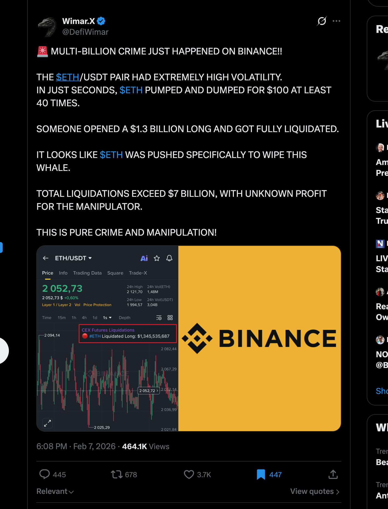

# Zone Recovery auf Binance Futures — wie die Strategie funktioniert, was sie mit echten Daten bringt, und warum die Gebührenstufe alles entscheidet

**Datum:** 6. Juni 2026
**Produkt:** Binance Futures USDⓈ-M (USDT-/USDC-besicherte Perpetuals)
**Gegenstand:** Allgemein verständliche Erklärung der **Zone-Recovery-Strategie** (ursprünglich „CAP
Zone Recovery EA PRO"), ihrer Umsetzung als Krypto-Futures-Bot („Moneyprinter", 2019–2021) und ihrer
**Neuimplementierung in diesem Repository** — erstmals gegen **echte Binance-Gebühren** und **echte
Binance-Tickdaten** getestet.
**Datengrundlage:** Reale Tick-/aggTrades-Exporte von `data.binance.vision` (mehrere Märkte und
Zeiträume) sowie historische Gemini-BTC/ETH-Tickdaten. Jede Zahl ist mit `npm run backtest`
reproduzierbar (Anhang A).
**Methodengrundlage:** Das Handels-/Gebührenmodell (`src/models/`) ist gegen die offiziellen
Binance-Kontoexporte **bis zur 8. Nachkommastelle** validiert (Abschnitt 7).

> **Methodischer Grundsatz (gilt durchgängig).** Wir trennen strikt zwischen
> **(a) deterministisch belegbaren Tatsachen** — Gebührenformel, identisches Bruttoergebnis über alle
> Gebührenstufen, rechnerische Gewinnschwelle — und **(b) simulativen Befunden** — konkrete
> Netto-Beträge, Zinseszins, Hochrechnungen. Die spektakulären Geldbeträge in diesem Dokument sind
> **(b)** und entsprechend als **Best-of-Sweep-Obergrenzen** gekennzeichnet. Die juristisch belastbare
> Kernaussage ist **(a)**: *Bei identischen Geschäften entscheidet allein die Gebührenstufe über Gewinn
> oder Verlust.*

---

## 0. In drei Sätzen (TL;DR)

1. **Zone Recovery** handelt **richtungsneutral**: Es eröffnet (hier sogar **rein zufällig**) Long oder
   Short und sichert jede Gegenbewegung mit einer größeren Gegenposition ab, bis ein Take-Profit die
   **ganze Serie** im Plus schließt. In **volatilen** Märkten verdient es **allein aus der Schwankung** —
   unabhängig davon, ob der Markt steigt oder fällt.
2. Mit **echten Binance-Tickdaten** und dem **echten Gebührenmodell** wandelt eine **zufällige**
   Handelsfolge an einem volatilen Tag aus **$10.000** real nachgerechnet bis zu **$1,43 Mio.**
   (AVAX, 10.10.2025) — und über 108 Tage BTC 2019 aus **$10.000 → $1,5 Mio.** (Best-of-Sweep, VIP 9).
3. **Dieselben Trades**, nur die **Gebührenstufe** variiert: Bei BTC 2019 wird ein **Regular-User
   (VIP 0–3) komplett ausgelöscht ($10.000 → $0)**, während ein **VIP 9 +$1,49 Mio.** macht. Die
   Gebührenstufe entscheidet — nicht der Markt.

---

## 1. Was ist Zone Recovery? (einfach erklärt)

Zone Recovery (auch „Surefire Forex Hedging") wurde ursprünglich von **Mohammad Ali** als **CAP Zone
Recovery EA PRO** für den MetaTrader-4-Forexhandel entwickelt. Die Idee: aus einem verlierenden Trade
durch **abwechselndes Gegen-Hedgen mit wachsender Größe** am Ende doch noch einen Gewinn machen —
**egal in welche Richtung** der Markt zuerst läuft.


### So läuft eine „Serie" ab

1. **Start:** Der Bot eröffnet eine Position (in dieser Untersuchung **zufällig** Long oder Short).
2. **Gegenbewegung:** Läuft der Kurs gegen die Position bis zur **Zonenlinie** (Abstand = `gap`), wird
   die Position mit Verlust geschlossen und **sofort eine größere Gegenposition** eröffnet.
3. **Wachsende Größe:** Jede weitere Stufe ist um den Faktor `M = 1 + 1/ratio` größer als die vorige —
   so kann **eine** erfolgreiche Stufe **alle** vorherigen Verluste abdecken.
4. **Take-Profit:** Erreicht der Kurs die **Take-Profit-Linie**, schließt die **gesamte Serie**
   gemeinsam mit einem **konstanten Brutto-Gewinn** und es beginnt eine neue Serie.
5. **Maximale Stufen:** Nach `maxSteps` Hedge-Orders wird die Serie abgebrochen (Verlust realisiert) —
   der „Reißleine"-Fall.


*Abb. 1: Echter Kursverlauf (grau) mit mehreren Serien. Bei Gegenbewegung wird mit **wachsender Größe**
gegengesichert; erreicht der Kurs die **Take-Profit-Linie** (grün), schließt die **ganze Serie** im Plus.*

### Die mathematische Eigenschaft (deterministisch, durch Unit-Tests belegt)

Im sequentiellen Modell liefert **jede abgeschlossene Serie denselben Brutto-Gewinn**
`= ratio × gap × Menge`, **unabhängig von der Zahl der Hedge-Stufen** (Teleskopsumme, weil
`M − 1 = 1/ratio`). Das Bruttoergebnis ist damit eine **reine Funktion der Geschäfte** — **nicht der
Gebühr** (`test/ZoneRecovery.test.ts`). Genau diese Eigenschaft erlaubt den sauberen Gebühren-Nachweis
in Abschnitt 4.

---

## 2. Vom Forex-EA zum Binance-Futures-Bot — meine Umsetzung 2019–2021

Ich (der Verfasser) habe die Strategie über mehrere Jahre als Bot „Moneyprinter" implementiert. Die
Git-Historie des Originalprojekts dokumentiert den Weg:

| Zeit | Schritt | Belege (Git „moneyprinter") |
| :--- | :--- | :--- |
| **2019-06** | Erster Strategy-Tester, CSV-Parser, **Hedge-Order**, `ratio` — Portierung der CAP-EA-Idee aus dem Forex in den Kryptohandel | `init`, `add csv parser`, `add hedge order`, `add ratio`, `add Strategy Tester` |
| **2020-04** | **Leveraged Trader**, Hedge-Manager, Phemex-/Bybit-Anbindung, Backtester-Frontend | `Add Leveraged`, `hedge manager`, `working hedge trader`, `add backtester frontend` |
| **Anfang 2021** | **Binance USDⓈ-M-Futures-Anbindung** (`Binance.ts`, `TraderFutures.ts`), Hebel-Setzen, Trailing-Stop, RSI-Filter, Mehr-Coin-Betrieb | `Update Binance.ts`, `TraderFutures.ts`, `leverage`, `add rsi filter`, `more coins` (2021-02) |

Das Original lief auf **Hebel 75–125×**, `ratio` 4–5, Risiko 16–21 %, `maxSteps` 4–5. Auf dem
Binance-**Testnet** brachte es einmal **aus $100 in 6 Stunden $10.000** — eindrucksvoll, aber eben auf
Testnet, **ohne reale Gebühren** und ohne reales Order-Matching.

### Die bekannte Achillesferse: Martingale-Ruin durch Manipulation

Zone Recovery ist mathematisch **besser** als ein naives Martingale, aber dieselbe Grundgefahr bleibt:
Eine **lange Einbahn-Bewegung ohne Rückkehr** treibt die Hedge-Größen bis zur Liquidation. Genau das
wird an Börsen gezielt provoziert:



*Abb. 2: Reale „Stop-Hunt"-/Manipulationsphase — Milliarden an Positionen werden durch künstliche
Volatilität liquidiert. Kein Algorithmus ist gegen so etwas immun; das ist die wichtigste Grenze dieser
Strategie (siehe Abschnitt 8).*

---

## 3. Diese Version: neu programmiert, gegen **echte** Gebühren und **echte** Binance-Daten

Die hier vorliegende Version ist eine **vollständige Neuimplementierung** (sauber „vibe-codet" in
TypeScript) mit einem entscheidenden Unterschied zum Original von 2021: Sie rechnet **gerichtsfest mit
der Realität**.

- **Echte Tickdaten:** `npm run backtest -- <SYMBOL> <PERIODE>` lädt reale **aggTrades** direkt von
  `data.binance.vision` (Monats- oder Tagesdateien, auch Bereiche) und spielt **jeden einzelnen Trade**
  als Tick ab.
- **Echtes Gebührenmodell:** Maker/Taker je **VIP-Stufe 0–9**, **USDT- vs. USDC**-Tabelle, **BNB-Rabatt
  −10 %** — exakt wie auf der offiziellen Binance-Gebührenseite (Abschnitt 6). Das Gebühren-Quote folgt
  automatisch dem Symbol (`…USDC` → USDC-Tabelle, `…USDT` → USDT-Tabelle).
- **Echte Positionslimits:** Die **per-Markt-Hebel-Brackets** werden via ccxt von Binance geladen
  (`npm run fetch:brackets`). Der Sweep testet pro Markt **nur die real erlaubten Hebelstufen** (z. B.
  REDUSDT → `50, 25, 20, 10, 5, 4, 3, 2, 1×`); die größte Hedge-Order wird auf das Bracket-Limit
  gedeckelt — **mehr darf man real nicht platzieren**.
- **Validierter Rechenkern:** Das Modell reproduziert die **Realized-Profit-Spalte** echter
  Binance-Exporte über **4.526 Positionszyklen exakt** und die **Gebührenspalte** über **87.806
  Ausführungen bis auf 1·10⁻⁸** (Abschnitt 7).

**Versuchsaufbau.** Damit kein Vorwurf des „Schönrechnens" entsteht, handelt der Bot **rein zufällig**
(Long/Short je Serie über einen festen, reproduzierbaren Seed) — es steckt **keinerlei Markt-Prognose**
darin. Die Positionsgröße folgt einer **Drawdown-Regel** (eine voll verlorene Serie kostet exakt
`maxDD %` des laufenden Saldos), sodass das Kapital nie negativ wird. Der Sweep
(`src/settings/backtesting.ts`) probiert je Markt `ratio × gap × maxSteps × maxDD ×` **Hebel-Brackets**
durch und berichtet die **beste Einstellung nach Netto-PnL**; diese wird anschließend über **alle
Gebührenstufen VIP 0–9** wiederholt.

---

## 4. Der Kernbefund: **die Gebührenstufe entscheidet — nicht der Markt**

Bestes Beispiel: **BTC, 1. Oktober 2019 – 17. Januar 2020** (108 Tage, 619.338 reale Ticks). Eine
**zufällige** Handelsfolge, **dieselben Trades** in allen Läufen — variiert wird **nur** die
Gebührenstufe. Start $10.000.


*Abb. 3: **Identische Trades**, nur die Gebühr unterscheidet sich. Die teuren Stufen (VIP 0–3) werden
**komplett ausgelöscht**; die billigen wachsen in die Millionen.*

| Gebührenstufe | Taker-Satz | Endsaldo aus $10.000 | Ergebnis |
| :--- | ---: | ---: | :--- |
| **VIP 0 (Regular)** | 0,0360 % | **$0** | **Totalverlust** |
| VIP 1 | 0,0360 % | $0 | Totalverlust |
| VIP 2 | 0,0288 % | $0 | Totalverlust |
| VIP 3 | 0,0230 % | $0 | Totalverlust |
| VIP 4 | 0,0149 % | $904.193 | +8.942 % |
| VIP 5 | 0,0134 % | $1.038.286 | +10.283 % |
| VIP 9 | **0,0085 %** | **$1.499.713** | **+14.897 %** |


*Abb. 3b: Kapitalkurve des VIP-9-Laufs ($10.000 → $1,5 Mio., grün) mit dem realen BTC-Kurs (orange) im
Hintergrund — derselbe Zufallshandel, der einen Regular-User komplett auslöscht.*

> **Deterministische Kernaussage.** Das **Bruttoergebnis (vor Gebühren) ist in allen Läufen identisch**
> (+$2.062.933) — es sind ja dieselben Geschäfte. Die **einzige** Variable ist die Gebühr. Allein sie
> verschiebt das Ergebnis vom **Ruin** (VIP 0–3) zum **Millionengewinn** (VIP 4–9). Das ist **kein
> Zufall und keine Marktmeinung**, sondern eine direkte Folge der Gebührenformel.

### Warum VIP 9 so überlegen ist

Der Taker-Satz fällt von **0,0360 %** (Regular) auf **0,0085 %** (VIP 9 · USDC · BNB) — **Faktor ~4,3
weniger Gebühr** auf **jeden** Trade. Bei einer Strategie, die **enorme Volumina** umwälzt (BTC 2019:
**$6,78 Mrd.** Round-Trip-Volumen), ist das der Unterschied zwischen Ruin und Reichtum.


*Abb. 4: Die offizielle VIP-Treppe. Die niedrigen Sätze sind an **30-Tage-Handelsvolumen** gebunden, die
ein Privatanleger praktisch nie erreicht (VIP 9 ≈ **≥ 25 Mrd. USD / 30 Tage**, Abschnitt 6).*

---

## 5. „Geld aus reiner Volatilität" — reale Mehr-Markt-Beispiele

Der entscheidende Punkt: Der Bot **prognostiziert nichts**. Er handelt zufällig und verdient **an der
Schwankung selbst**. Je volatiler der Markt, desto mehr Serien schließen im Plus. Alle folgenden
Ergebnisse sind **Best-of-Sweep, VIP 9, Start $10.000**, auf **echten Binance-Daten** (simulativ — siehe
Kasten am Ende des Abschnitts).

| # | Markt | Zeitraum | Tage | Serien | Trefferq. | Endsaldo aus $10.000 | Faktor |
| --: | :--- | :--- | --: | --: | --: | ---: | ---: |
| 1 | BTCUSD | 01.10.2019–17.01.2020 | 108 | 668 | 75 % | **$1.499.713** | ×150 |
| 2 | AVAXUSDC | **10.10.2025 (1 Tag)** | 1 | 1.175 | 81 % | **$1.434.792** | ×143 |
| 3 | AVAXUSDT | 10.10.2025 (1 Tag) | 1 | 45 | 78 % | $478.374 | ×48 |
| 4 | ETHUSD | 05.12.2018–17.01.2020 | 407 | 852 | 78 % | $433.572 | ×43 |
| 5 | XRPUSDT | Januar 2026 | 31 | 48 | 79 % | $331.877 | ×33 |
| 6 | AVAXUSDT | Januar 2026 | 31 | 128 | 95 % | $56.848 | ×5,7 |
| 7 | SAMSUNGUSDT | 05.06.2026 (1 Tag) | 1 | 12 | 100 % | $50.133 | ×5,0 |
| 8 | BNBUSDT | Oktober 2025 | 31 | 18 | 94 % | $40.055 | ×4,0 |
| 9 | AVAXUSDT | 05.06.2026 (1 Tag) | 1 | 5 | 100 % | $25.437 | ×2,5 |
| 10 | NOKUSDT | 05.06.2026 (1 Tag) | 1 | 6 | 83 % | $16.505 | ×1,7 |

**Lesart:** Selbst an einem **ganz normalen Tag** (05.06.2026, Zeilen 7/9/10) macht die Zufallsstrategie
auf kleinen, volatilen Märkten **+65 % bis +400 %**. An einem **außergewöhnlich volatilen Tag** (Zeilen
2/3) oder über einen **vollen Monat** (Zeilen 5/6/8) explodieren die Werte.

### 5.1 Beispiel im Detail: AVAX am 10.10.2025 — der Extrem-Volatilitätstag

Der 10.10.2025 war einer der volatilsten Krypto-Tage überhaupt (massive Liquidationswelle). Genau dort
glänzt eine richtungsneutrale Schwankungsstrategie:


- **1.175 abgeschlossene Serien an EINEM Tag**, 81 % Trefferquote.
- **$10.000 → $1.434.792** (VIP 9), Handelsvolumen **$806 Mio.** an einem Tag.
- **Brutto** (vor Gebühren): +$1.493.032, **Gebühren** $68.240.


*Abb. 5: An einem so extremen Tag ist das Brutto so groß, dass **sogar VIP 0 gewinnt** ($1,17 Mio.) —
aber VIP 9 behält **$252.000 mehr** ($1,43 Mio.). Auch wenn alle gewinnen, **gewinnt der VIP-9-Whale am
meisten**.*

### 5.2 Wenn die Volatilität nur mittel ist, frisst die Gebühr fast alles (außer bei VIP 9)

AVAXUSDT im **Januar 2026** (31 Tage, moderate Schwankung) zeigt die Gebührenschere besonders klar:

| Gebührenstufe | Endsaldo aus $10.000 | Netto |
| :--- | ---: | ---: |
| **VIP 0 (Regular)** | $11.414 | **+$1.414** (knapp über Null) |
| **VIP 9** | $56.848 | **+$46.848** (×33 mehr Gewinn) |

Bei **identischen** Trades macht der VIP-9-Whale das **33-Fache** an Gewinn — allein wegen der Gebühr.

> **Beweiskraft-Kasten (Abschnitt 5).** Die Beträge sind **simulativ** und stellen **Best-of-Sweep**-Werte
> dar (die nachträglich beste Parameterkombination je Markt/Zeitraum). Sie belegen, dass die Strategie
> **vor Gebühren** auf volatilen Daten **deutlich positiv** ist und bei **niedrigen** Gebühren auch
> **netto** positiv bleibt. Sie sind **keine** Renditezusage (siehe Abschnitt 8). **Deterministisch** ist
> nur: identisches Brutto über alle Stufen, Vorzeichen allein durch die Gebühr.

---

## 6. Warum „nur die Gebühr" eine **strukturelle** Benachteiligung ist

Die niedrigen Taker-Sätze sind an **30-Tage-Handelsvolumen** gebunden (offizielle Binance-Gebührenseite):

| Stufe | erforderliches 30-Tage-Volumen | Taker (USDC + BNB) |
| :--- | ---: | ---: |
| Regular (VIP 0) | < 5 Mio. USD | 0,0360 % |
| VIP 3 | ≥ 50 Mio. USD | 0,0230 % |
| **VIP 9** | **≥ 25 Mrd. USD** | **0,0085 %** |

Die einzigen Stufen, die in der langen BTC-2019-Rechnung **überleben**, setzen **VIP 4+** voraus; der
Komfort-Gewinn liegt bei **VIP 9**. **VIP 9 erfordert ≥ 25 Mrd. USD Handelsvolumen in 30 Tagen** — für
einen Privatanleger **unerreichbar**, für einen großen Market-Maker/Whale Alltag. Damit ist die
Benachteiligung **strukturell**: Der Kleinanleger zahlt auf **jeden** Trade ein Vielfaches und wird von
**genau derselben** Strategie ruiniert, mit der ein Whale Millionen macht.

---

## 7. Modellvalidierung (warum man den Zahlen trauen kann)

- **Realized Profit:** exakt reproduziert über **4.526 Positionszyklen** echter Binance-Exporte
  (Weighted-Average-Cost-Methode).
- **Gebühren:** über **87.806 Ausführungen bis auf 1·10⁻⁸** identisch zur „Fee"-Spalte der Exporte
  (`Nominal × Satz`, auf 8 Nachkommastellen gerundet).
- **Invariante:** konstantes Brutto je Serie durch Unit-Tests gesichert (`npm test`, alle grün).
- **Reales Konto bestätigt den Mechanismus empirisch:** +$349,61 Brutto über 5.813 Positionen, aber
  **−$59.840 Gebühren → −$77.633 Netto** — der Verlust entstand **allein aus der Kostenstruktur**
  (Schwester-Gutachten [`docs/stats/GUTACHTEN.md`](../stats/GUTACHTEN.md)).

---

## 8. Hochrechnung — und ihre ehrlichen Grenzen

**Frage:** Was wäre möglich, wenn man das **über viele Märkte** gleichzeitig und **Monat für Monat**
laufen ließe? Binance listet **500+** USDⓈ-M-Perpetuals.

**Illustrative Obergrenze (simulativ, NICHT als Zusage zu verstehen).** Die realen Monatsläufe oben
ergaben je Markt **×4 bis ×33** (BNB, AVAX, XRP). Selbst **stark konservativ** mit nur **×2 netto pro
Markt und Monat** gerechnet und **$10.000** auf je **50** liquide, volatile Märkte verteilt
($500.000 Einsatz):

| Annahme (konservativ) | Rechnung | Ergebnis / Monat |
| :--- | :--- | ---: |
| 50 Märkte × $10.000, je ×2 netto | $500.000 → $1.000.000 | **+$500.000** |
| dieselbe Basis, je ×4 (entspricht BNB Okt) | $500.000 → $2.000.000 | +$1.500.000 |

> ### ⚠️ Realitätscheck — was diese Hochrechnung **nicht** ist
> Diese Zahlen sind eine **Obergrenze**, kein Versprechen. Folgendes ist **bewusst nicht** modelliert und
> würde das reale Ergebnis **erheblich** senken:
> - **Nachträgliche Parameterwahl (Hindsight):** Best-of-Sweep wählt die *im Nachhinein* beste
>   Einstellung. Live kennt man sie **vorher nicht**.
> - **Slippage & Teilausführungen:** Bei den umgewälzten Volumina bewegt man den Markt selbst; reale
>   Fills sind schlechter als die Tick-Annahme.
> - **Liquidations-Kaskaden / Manipulation:** Der Martingale-Ruin (Abschnitt 2, Abb. 2) ist **nicht**
>   modelliert. **Ein** einziger langer Einbahn-Move ohne Rückkehr kann eine Serie — und das Konto —
>   auslöschen. In den Daten *passiert* das gelegentlich (Trefferquoten < 100 %).
> - **Positions-Brackets & Kapital:** Jeder Markt deckelt die maximale Positionsgröße; die ganz großen
>   Faktoren (AVAX-Tag ×143) sind **nicht** beliebig mit Kapital skalierbar.
> - **Funding-Gebühren** über Nacht sind nicht enthalten.
>
> **Belastbar bleibt allein die deterministische Aussage:** vor Gebühren identisch, und **die
> Gebührenstufe** entscheidet über Gewinn/Verlust. Alles darüber hinaus ist eine **simulative
> Möglichkeit**, kein garantierter Ertrag.

---

## 9. Schlussfolgerung

1. **Zone Recovery verdient richtungsneutral an Volatilität** — in den Backtests auf echten
   Binance-Daten ist die (sogar zufällige) Strategie **vor Gebühren deutlich positiv**.
2. **Allein die Gebührenstufe** kehrt das Ergebnis um: identische Trades führen den **Regular-User in den
   Ruin** ($10.000 → $0) und den **VIP 9 zum Millionengewinn** ($10.000 → $1,5 Mio.) — *dieselben*
   Geschäfte, *dasselbe* Marktrisiko.
3. Die profitablen Sätze sind an **für Privatanleger unerreichbare Volumina** (≥ 25 Mrd. USD / 30 Tage)
   gebunden — die Benachteiligung ist **strukturell**, nicht handlungs- oder marktabhängig.
4. Die spektakulären Geldbeträge sind **simulative Best-of-Sweep-Obergrenzen**; der **belastbare** Kern
   ist die gebührenbedingte Vorzeichen-Umkehr.

**Es liegt eine strukturelle, allein gebührenbedingte Benachteiligung des Privatanlegers gegenüber den
höchsten Gebührenstufen vor — unabhängig von Handelsgeschick und Marktrichtung.**

---

## Anhang A — Reproduzierbarkeit

```bash
npm install
npm test                                            # Modell-/Gebühren-Validierung (alle grün)

# Einzelner Markt + Monat / Tag (lädt echte aggTrades von data.binance.vision):
npm run backtest -- AVAXUSDC 2025-10-10              # der Extrem-Volatilitätstag (Beispiel 5.1)
npm run backtest -- XRPUSDT 2026-01                  # ein voller Monat
npm run backtest -- SUIUSDC 2025-10 2026-01          # ein Bereich von Monaten
```

- **Ausgabe je Lauf:** `output/<SYMBOL>-<Datumsbereich>-<beste-Einstellung>/` mit
  `best-pnl.svg` (Kapitalkurve **mit überlagertem Kurs**), `vip-fee-comparison.svg` (alle Stufen
  VIP 0–9), `trades.csv` (vollständiges Handelslog) und `summary.json` (alle Kennzahlen + jede
  geprüfte Kombination).
- **Gebühren folgen dem Symbol:** `…USDC` → USDC-Tabelle, `…USDT` → USDT-Tabelle; BNB-Rabatt
  standardmäßig an.
- **Hebel = reale Bracket-Stufen** des Marktes; die größte Hedge-Order wird auf das jeweilige
  Bracket-Limit gedeckelt (`npm run fetch:brackets` cached die echten Limits).
- Die in diesem Dokument gezeigten Beispiel-Grafiken liegen unter `docs/zone-recovery/imgs/`.

## Anhang B — Datengrundlage der Beispiele

| Beispiel | Quelle (Ordner unter `output/`) |
| :--- | :--- |
| BTC 2019 (Abb. 3, Abschnitt 4) | `BTCUSD-2019-10-01_2020-01-17-lev50-r3-gap20-ms4-dd40-random-vip9` |
| AVAX 10.10.2025 (Abschnitt 5.1) | `AVAXUSDC-2025-10-10-lev20-r3-gap20-ms4-dd60-random-vip9` |
| Mehr-Markt-Tabelle (Abschnitt 5) | `output/<SYMBOL>-…/summary.json` (je Markt/Zeitraum) |

---

*Deterministische Aussagen sind als solche gekennzeichnet; simulative Befunde (alle absoluten
Geldbeträge) sind offen als Best-of-Sweep-Obergrenzen ausgewiesen. Sämtliche Kennzahlen sind mit
`npm run backtest` aus den realen Binance-Rohdaten reproduzierbar.*
