# Zone Recovery auf Binance Futures — wie die Strategie funktioniert, was sie mit echten Daten bringt, und warum die Gebührenstufe alles entscheidet

**Datum:** 6. Juni 2026
**Produkt:** Binance Futures USDⓈ-M (USDT-/USDC-besicherte Perpetuals)
**Gegenstand:** Allgemein verständliche Erklärung der **Zone-Recovery-Strategie** (ursprünglich „CAP
Zone Recovery EA PRO"), ihrer Umsetzung als Krypto-Futures-Bot („Moneyprinter", 2019–2021) und ihrer
Neufassung — erstmals geprüft gegen **echte Binance-Gebühren** und **echte Binance-Handelsdaten**.
**Datengrundlage:** Reale, von Binance öffentlich bereitgestellte Einzelhandels-Daten (jeder einzelne
Trade) mehrerer Märkte und Zeiträume sowie historische BTC-/ETH-Daten.
**Reproduzierbarkeit:** Sämtliche Programme, Rohdaten-Bezüge und Ergebnisse sind öffentlich einsehbar
und **selbst nachrechenbar** unter **https://github.com/mahapo/binance-case-stats**.

> **Methodischer Grundsatz (gilt durchgängig).** Wir trennen strikt zwischen
> **(a) deterministisch belegbaren Tatsachen** — der Gebührenformel, dem über alle Gebührenstufen
> identischen Ergebnis *vor* Gebühren und der rechnerischen Gewinnschwelle — und **(b) simulativen
> Befunden** — den konkreten Geldbeträgen und Hochrechnungen. Die juristisch belastbare Kernaussage ist
> **(a)**: *Bei identischen Geschäften entscheidet allein die Gebührenstufe über Gewinn oder Verlust.*
>
> **Was bedeutet „beste getestete Einstellung"?** Der Backtester probiert pro Markt **viele
> Einstellungen** durch (Hebel, Zonen-Abstand, Anzahl Stufen, Risiko) und weist anschliessend die **im
> Nachhinein beste** aus. Alle absoluten Geldbeträge sind daher **Obergrenzen** — sie zeigen, *was
> möglich war*, nicht, was man im Voraus garantiert erzielt. So sind sie im ganzen Dokument zu lesen.

---

## 0. In drei Sätzen (Kurzfassung)

1. **Zone Recovery** ist **richtungsneutral**: Es eröffnet eine Position und sichert jede Gegenbewegung
   mit einer grösseren Gegenposition ab, bis ein Gewinnziel die **ganze Serie** im Plus schliesst. In
   **volatilen** Märkten verdient es **allein aus der Schwankung** — egal ob der Markt steigt oder fällt.
2. **Worum es hier geht:** Wir zeigen, dass diese **Hedge-Methode bereits im Normalfall funktioniert** —
   und zwar **bewusst ohne jede Marktmeinung** (der Bot setzt rein zufällig Long/Short). Das ist der
   **konservative Boden**: Mit gezieltem Einstieg per **technischer Analyse** statt Zufall liesse sich
   **noch deutlich mehr** herausholen.
3. **Der eigentliche Befund:** Bei **denselben Trades** entscheidet **allein die Gebührenstufe** über
   Gewinn oder Verlust. Beim Beispiel BTC 2019 wird ein **Privatanleger (VIP 0–3) komplett ausgelöscht
   ($10.000 → $0)**, während ein Grosshändler **(VIP 9) +$1,49 Mio.** macht — gleiche Geschäfte.

---

## 1. Was ist Zone Recovery? (einfach erklärt)

Zone Recovery (auch „Surefire Forex Hedging") wurde ursprünglich von **Mohammad Ali** als **CAP Zone
Recovery EA PRO** für den MetaTrader-4-Forexhandel entwickelt. Die Idee: aus einem verlierenden Trade
durch **abwechselndes Gegen-Hedgen mit wachsender Grösse** am Ende doch noch einen Gewinn machen —
**egal, in welche Richtung** der Markt zuerst läuft.

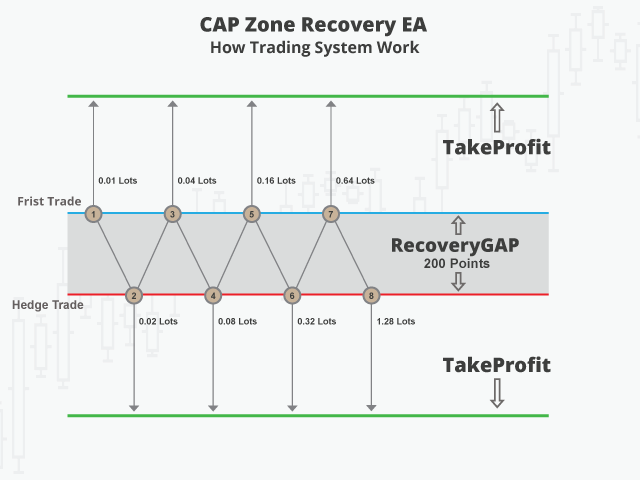
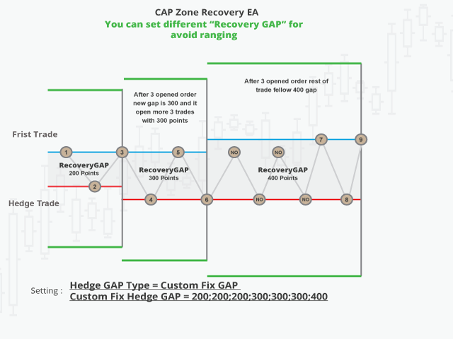
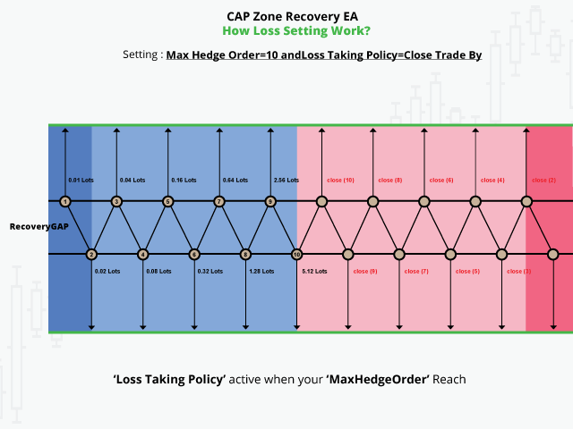

### So läuft eine „Serie" ab

1. **Start:** Es wird eine Position eröffnet (in dieser Untersuchung bewusst **zufällig** Long oder Short).
2. **Gegenbewegung:** Läuft der Kurs gegen die Position bis zur **Zonenlinie** (Abstand = „Gap"), wird die
   Position mit Verlust geschlossen und **sofort eine grössere Gegenposition** eröffnet.
3. **Wachsende Grösse:** Jede weitere Stufe ist um einen festen Faktor grösser als die vorige — so kann
   **eine** erfolgreiche Stufe **alle** vorherigen Verluste abdecken.
4. **Gewinnziel:** Erreicht der Kurs die **Take-Profit-Linie**, schliesst die **gesamte Serie** gemeinsam
   mit einem **konstanten Gewinn (vor Gebühren)**, und es beginnt eine neue Serie.
5. **Maximale Stufen:** Nach einer festen Höchstzahl an Hedge-Stufen wird die Serie abgebrochen (Verlust
   realisiert) — der „Reissleine"-Fall.


*Abb. 1: Echter Kursverlauf (grau) mit mehreren Serien. Bei Gegenbewegung wird mit **wachsender Grösse**
gegengesichert; erreicht der Kurs die **Gewinnlinie** (grün), schliesst die **ganze Serie** im Plus.*

### Die mathematische Eigenschaft (deterministisch, durch automatisierte Tests abgesichert)

Im Modell liefert **jede abgeschlossene Serie denselben Gewinn vor Gebühren** — **unabhängig von der
Zahl der Hedge-Stufen**. Das Ergebnis vor Gebühren ist damit eine **reine Funktion der Geschäfte** —
**nicht der Gebühr**. Genau diese Eigenschaft erlaubt den sauberen Gebühren-Nachweis in Abschnitt 4.

---

## 2. Von einem YouTube-Video zur geprüften Auswertung — meine Geschichte 2010–2026

Ich (der Verfasser) bin **um 2010–2011 mit ca. 18 Jahren** auf diese Strategie gestossen — durch ein
YouTube-Video über das „Surefire"-/Zone-Recovery-Hedging
([youtube.com/watch?v=DJz4E7VyeSw](https://www.youtube.com/watch?v=DJz4E7VyeSw)). Schon damals
programmierte ich **Expert Advisors (Handels-Bots) und Indikatoren für MetaTrader 4/5** und baute die
Zone-Recovery-Idee zum ersten Mal als MT4-Bot nach. Über die Jahre habe ich sie mehrfach neu umgesetzt;
die jeweilige Versionsgeschichte ist dokumentiert:

| Zeit | Schritt |
| :--- | :--- |
| **~2010–2011** | Erstkontakt über das YouTube-Video (mit ca. 18 J.); **Bot-/Indikator-Programmierung für MetaTrader 4/5**, erster Zone-Recovery-Nachbau im Forex. |
| **2019** | Erster Krypto-Strategietester samt Hedge-Logik — Übertragung der Forex-Idee auf den Kryptohandel (Projekt „Moneyprinter"). |
| **2020** | Gehebelter Handel, Hedge-Verwaltung, Anbindung erster Krypto-Börsen, Backtest-Oberfläche. |
| **Anfang 2021** | Anbindung an **Binance USDⓈ-M-Futures** (echtes Hebel-/Order-Handling, weitere Coins). |
| **2023–2025** | **Erste Neufassung** — Umbau in modernen, getesteten Code mit sauberem Gebühren-/Order-Modell. |
| **2026** | **Diese Version** — geprüfter Backtester: validierte Rechenlogik, **echte** Binance-Gebühren, **echte** Handelsdaten, reale Positionslimits je Markt. |

Das Original (Moneyprinter, 2021) lief auf **Hebel 75–125×**. Auf dem **Test-Netz** von Binance
verwandelte es einmal **aus $100 in sechs Stunden $10.000** — eindrucksvoll, aber eben auf einem
Test-Netz, **ohne reale Gebühren** und ohne reales Order-Matching. Genau diese Lücke schliesst die
vorliegende Auswertung.

---

## 3. Diese Version: geprüft gegen **echte** Gebühren und **echte** Binance-Daten

Die vorliegende Fassung rechnet **mit der Realität** — das ist der entscheidende Unterschied zu früheren
Test-Netz-Zahlen:

- **Echte Handelsdaten:** Es werden die von Binance öffentlich bereitgestellten **Einzelhandels-Daten**
  (jeder einzelne ausgeführte Trade) eines Marktes und Zeitraums abgespielt — kein vereinfachtes Modell.
- **Echtes Gebührenmodell:** Maker-/Taker-Sätze je **VIP-Stufe 0–9**, getrennt für **USDT** und **USDC**,
  inklusive **BNB-Rabatt (−10 %)** — exakt nach der offiziellen Binance-Gebührenseite (Abschnitt 6).
- **Echte Positionslimits:** Pro Markt werden die **realen Hebel- und Positions-Grenzen** von Binance
  verwendet; die grösste Order einer Serie wird auf das reale Limit gedeckelt — **mehr darf man auch in
  der Praxis nicht platzieren**.
- **Validierte Rechenlogik:** Das Modell reproduziert die offiziellen Binance-Kontoexporte (Spalten
  „Realized Profit" und „Fee") **bis zur 8. Nachkommastelle** (Abschnitt 7).

**Warum USDC-Paare?** Soweit nicht anders angegeben, werden **USDC-Märkte** verwendet, weil dort die
**Handelsgebühren am niedrigsten** sind (0 % Maker-Gebühr, niedrigster Taker-Satz). Das ist also der
**günstigste, konservative Gebührenfall** — bei teureren USDT-Märkten fällt das Ergebnis schlechter aus
(siehe den USDT-Vergleich in Abschnitt 4).

**Versuchsaufbau — bewusst ohne Können.** Damit kein Vorwurf des „Schönrechnens" entsteht, handelt der
Bot **rein zufällig** (Long oder Short je Serie per Zufall) — es steckt **keinerlei Marktprognose**
darin. Das ist Absicht: Es zeigt, dass die **Hedge-Methode schon ohne jede Fähigkeit** funktioniert.
**Mit technischer Analyse** (gezieltes Einsteigen statt Würfeln) liesse sich **mehr** herausholen — der
Zufallshandel ist also der **konservative Boden**, nicht die Obergrenze. Die Positionsgrösse folgt einer
festen Risiko-Regel (eine voll verlorene Serie kostet höchstens einen vorab festgelegten Prozentsatz des
Kapitals), sodass das Konto nicht ins Minus laufen kann.

---

## 4. Der Kernbefund: **die Gebührenstufe entscheidet — nicht der Markt**

Bestes Beispiel: **BTC, 1. Oktober 2019 – 17. Januar 2020** (108 Tage, 619.338 reale Trades). Eine
**zufällige** Handelsfolge, **dieselben Trades** in allen Läufen — variiert wird **nur** die
Gebührenstufe. Start $10.000.

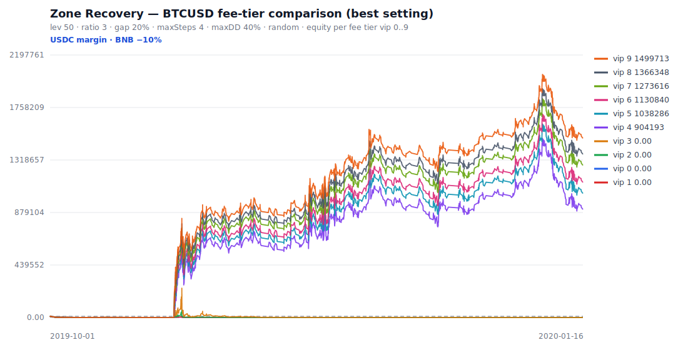

*Abb. 2: **Identische Trades**, nur die Gebühr unterscheidet sich. Die teuren Stufen (VIP 0–3) werden
**komplett ausgelöscht**; die günstigen wachsen in die Millionen.*

| Gebührenstufe | Taker-Satz | Endsaldo aus $10.000 | Ergebnis |
| :--- | ---: | ---: | :--- |
| **VIP 0 (Privatanleger)** | 0,0360 % | **$0** | **Totalverlust** |
| VIP 1 | 0,0360 % | $0 | Totalverlust |
| VIP 2 | 0,0288 % | $0 | Totalverlust |
| VIP 3 | 0,0230 % | $0 | Totalverlust |
| VIP 4 | 0,0149 % | $904.193 | +8.942 % |
| VIP 5 | 0,0134 % | $1.038.286 | +10.283 % |
| VIP 9 | **0,0085 %** | **$1.499.713** | **+14.897 %** |

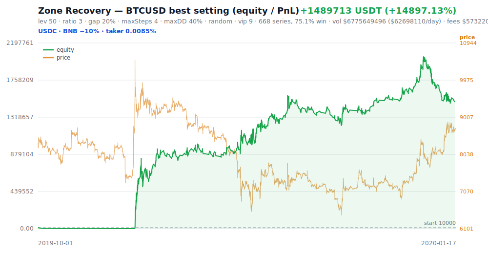

*Abb. 3: Kapitalkurve des VIP-9-Laufs ($10.000 → $1,5 Mio., grün) mit dem realen BTC-Kurs (orange) im
Hintergrund — derselbe Zufallshandel, der einen Privatanleger komplett auslöscht.*

> **Deterministische Kernaussage.** Das **Ergebnis vor Gebühren ist in allen Läufen identisch**
> (+$2.062.933) — es sind ja dieselben Geschäfte. Die **einzige** Variable ist die Gebühr. Allein sie
> verschiebt das Ergebnis vom **Ruin** (VIP 0–3) zum **Millionengewinn** (VIP 4–9). Das ist **kein Zufall
> und keine Marktmeinung**, sondern eine direkte Folge der Gebührenformel.

### Warum die höchste Stufe so überlegen ist

Der Taker-Satz fällt von **0,0360 %** (Privatanleger) auf **0,0085 %** (VIP 9 mit USDC + BNB) — rund
**Faktor 4** weniger Gebühr auf **jeden** Trade. Bei einer Strategie, die **enorme Volumina** umwälzt
(BTC 2019: **$6,78 Mrd.** Handelsvolumen), ist das der Unterschied zwischen Ruin und Reichtum.

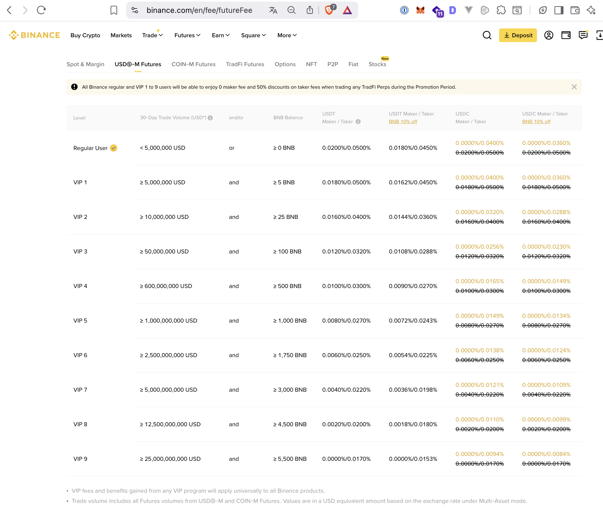

*Abb. 4: Die offizielle VIP-Treppe. Die niedrigen Sätze sind an **30-Tage-Handelsvolumen** gebunden, das
ein Privatanleger praktisch nie erreicht (VIP 9 ≈ **≥ 25 Mrd. USD / 30 Tage**, Abschnitt 6).*

---

## 5. „Geld aus reiner Volatilität" — reale Mehr-Markt-Beispiele

Der entscheidende Punkt: Der Bot **prognostiziert nichts**. Er handelt **zufällig** und verdient **an der
Schwankung selbst**. Je volatiler der Markt, desto mehr Serien schliessen im Plus. Alle folgenden
Ergebnisse stehen für die **im Nachhinein beste getestete Einstellung** bei **VIP 9, Start $10.000**, auf
**echten Binance-Daten** (simulativ — siehe Kasten am Ende des Abschnitts). Zur Erinnerung: Zufallshandel
ist der **konservative Boden**; mit technischer Analyse wäre mehr drin.

| # | Markt | Zeitraum | Tage | Serien | Trefferquote | Endsaldo aus $10.000 | Faktor |
| --: | :--- | :--- | --: | --: | --: | ---: | ---: |
| 1 | BTCUSD | 01.10.2019–17.01.2020 | 108 | 668 | 75 % | **$1.499.713** | ×150 |
| 2 | AVAXUSDC | **10.10.2025 (1 Tag)** | 1 | 1.175 | 81 % | **$1.434.792** | ×143 |
| 3 | ETHUSD | 05.12.2018–17.01.2020 | 407 | 852 | 78 % | $433.572 | ×43 |
| 4 | XRPUSDT | Januar 2026 | 31 | 48 | 79 % | $331.877 | ×33 |
| 5 | AVAXUSDT | Januar 2026 | 31 | 128 | 95 % | $56.848 | ×5,7 |
| 6 | BNBUSDT | Oktober 2025 | 31 | 18 | 94 % | $40.055 | ×4,0 |

**Lesart:** Über einen **vollen Monat** (Zeilen 4–6) wie über extreme **Einzeltage** (Zeile 2) ist die
Zufallsstrategie auf volatilen Märkten deutlich im Plus. Die folgenden Abschnitte zeigen das systematisch
über **alle** Märkte.

### 5.1 Beispiel im Detail: AVAX am 10.10.2025 — der Extrem-Volatilitätstag

Der 10.10.2025 war einer der volatilsten Krypto-Tage überhaupt (eine Liquidationswelle von rund
$19 Mrd.). Genau dort glänzt eine richtungsneutrale Schwankungsstrategie:

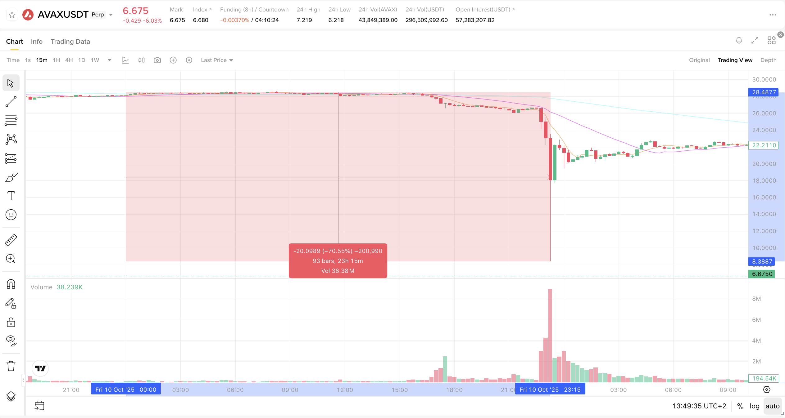

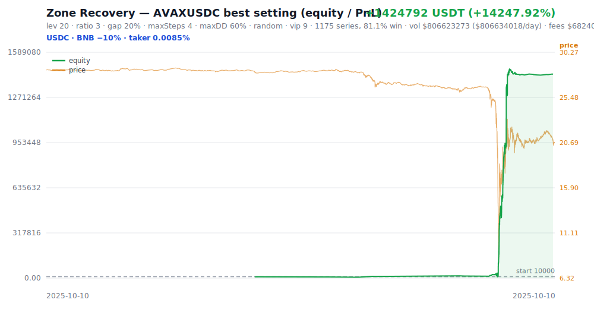

- **1.175 abgeschlossene Serien an EINEM Tag**, 81 % Trefferquote.
- **$10.000 → $1.434.792** (VIP 9), Handelsvolumen **$806 Mio.** an einem Tag.
- **Vor Gebühren:** +$1.493.032, **Gebühren** $68.240.

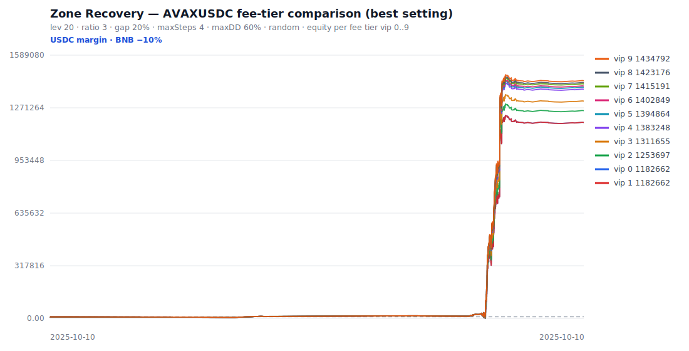

*Abb. 5–7: An einem so extremen Tag ist das Ergebnis vor Gebühren so gross, dass **sogar VIP 0 gewinnt**
($1,17 Mio.) — aber VIP 9 behält **$252.000 mehr** ($1,43 Mio.). Auch wenn alle gewinnen, **gewinnt der
Grosshändler am meisten**.*

### 5.2 Wenn die Volatilität nur mittel ist, frisst die Gebühr fast alles (ausser bei VIP 9)

AVAXUSDT im **Januar 2026** (31 Tage, moderate Schwankung) zeigt die Gebührenschere besonders klar:

| Gebührenstufe | Endsaldo aus $10.000 | Netto |
| :--- | ---: | ---: |
| **VIP 0 (Privatanleger)** | $11.414 | **+$1.414** (knapp über null) |
| **VIP 9** | $56.848 | **+$46.848** (×33 mehr Gewinn) |

Bei **identischen** Trades macht der Grosshändler das **33-Fache** an Gewinn — allein wegen der Gebühr.

### 5.3 Der ganze Markt in einem *normalen* Monat: alle 37 USDC-Märkte (Januar 2026)

Um zu zeigen, dass dies **kein Einzelfall** und **kein Crash-Glück** ist, wurde die Strategie auf **allen
37 handelbaren USDC-Märkten** über den **gesamten Januar 2026** laufen gelassen — überall **identischer
Aufbau**: $10.000 Start, **zufälliger** Handel, VIP 9. Der Januar 2026 war volatil (Crash am 29.01.,
BTC $96k → $80k), aber **kein** Extremereignis wie der 10.10. (USDC, weil dort die Gebühren am
niedrigsten sind.)

**Ergebnis: 37 von 37 Märkten profitabel.** $10.000 je Markt → im Schnitt **$94.685** (Ø **+847 %**) in
einem Monat.

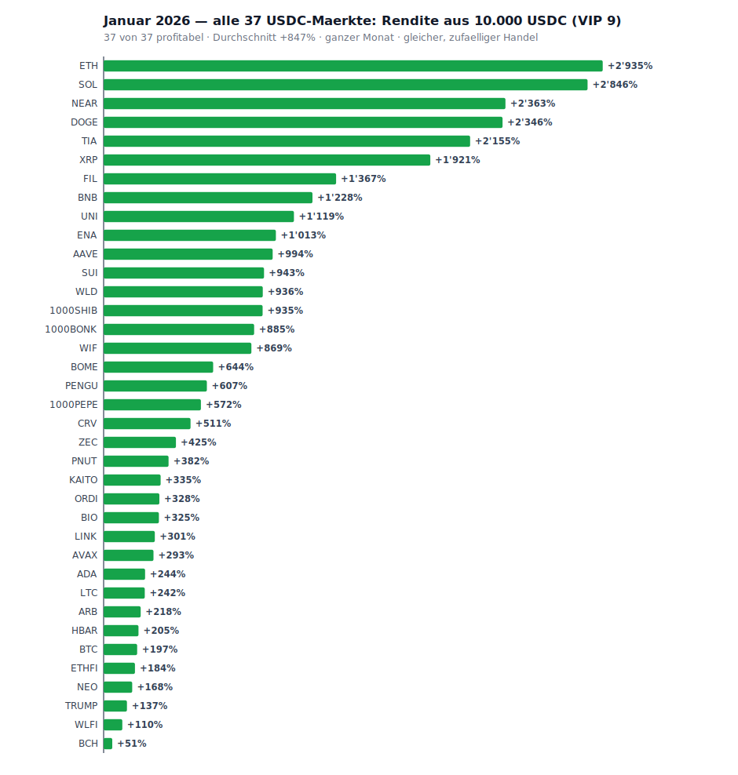

*Abb. 8: Jeder der 37 USDC-Märkte, $10.000 Start, zufälliger Handel, ein Monat. **Alle grün.***

| Markt | $10k → Ende | Rendite | Serien | Trefferq. | VIP-0-Ende |
| :--- | ---: | ---: | ---: | ---: | ---: |
| ETHUSDC | $303.490 | +2.935 % | 114 | 97 % | $43.446 |
| SOLUSDC | $294.617 | +2.846 % | 10 | 100 % | $278.534 |
| NEARUSDC | $246.307 | +2.363 % | 28 | 82 % | $223.896 |
| DOGEUSDC | $244.620 | +2.346 % | 66 | 80 % | **$3.219** |
| TIAUSDC | $225.499 | +2.155 % | 64 | 72 % | $182.728 |
| XRPUSDC | $202.119 | +1.921 % | 19 | 95 % | $188.717 |
| FILUSDC | $146.687 | +1.367 % | 14 | 100 % | $137.584 |
| BNBUSDC | $132.839 | +1.228 % | 15 | 87 % | $118.153 |
| UNIUSDC | $121.863 | +1.119 % | 81 | 93 % | $92.694 |
| ENAUSDC | $111.293 | +1.013 % | 160 | 85 % | $47.028 |
| AAVEUSDC | $109.357 | +994 % | 95 | 87 % | **$6.345** |
| *… weitere 26 Märkte, alle positiv (SUI +943 % … BCH +51 %)* | | | | | |
| **Summe (37)** | **$3.503.360** | Ø +847 % | | | $2.569.270 |

**$10.000 auf jedem der 37 Märkte ($370.000 Einsatz) → $3,50 Mio. (Netto +$3,13 Mio.) in einem Monat.**

#### Der detaillierte Gebühren-Vergleich: VIP 0 vs. VIP 9 (dieselben Trades)

Die Spalte **VIP-0-Ende** zeigt, was **derselbe** Handel bei Privatanleger-Gebühren ergibt. Die Regel ist
eindeutig: **je häufiger ein Markt handelt, desto mehr frisst die Gebühr.** Bei den „Vieltradern"
**verliert VIP 0 sogar Geld, während VIP 9 sechsstellig gewinnt** — bei **identischen** Geschäften:

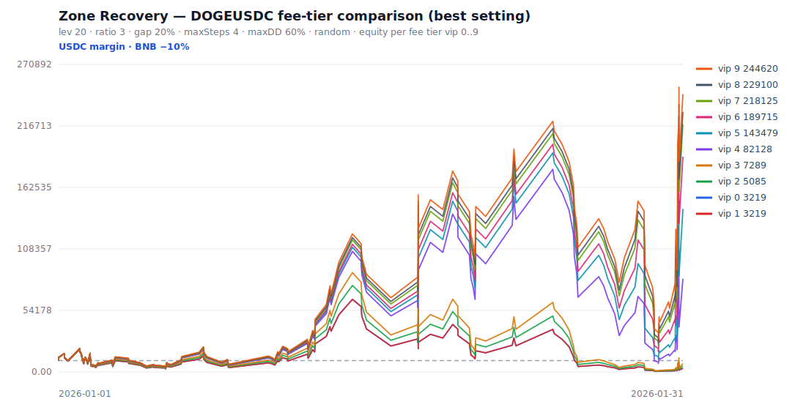

*Abb. 9: DOGEUSDC, ein voller Monat. Bei **identischen** Trades verliert VIP 0, während die hohen Stufen
in den sechsstelligen Bereich wachsen — allein wegen der Gebühr.*

| Markt | Serien | VIP 9 (netto) | VIP 0 (netto) | Verhältnis |
| :--- | ---: | ---: | ---: | :--- |
| **DOGEUSDC** | 66 | +$234.620 | **−$6.781** | VIP 0 **verliert** |
| **AAVEUSDC** | 95 | +$99.357 | **−$3.655** | VIP 0 **verliert** |
| ETHUSDC | 114 | +$293.490 | +$33.446 | VIP 9 ×8,8 |
| ENAUSDC | 160 | +$101.293 | +$37.028 | VIP 9 ×2,7 |
| SOLUSDC *(wenige Trades)* | 10 | +$284.617 | +$268.534 | VIP 9 ×1,06 |

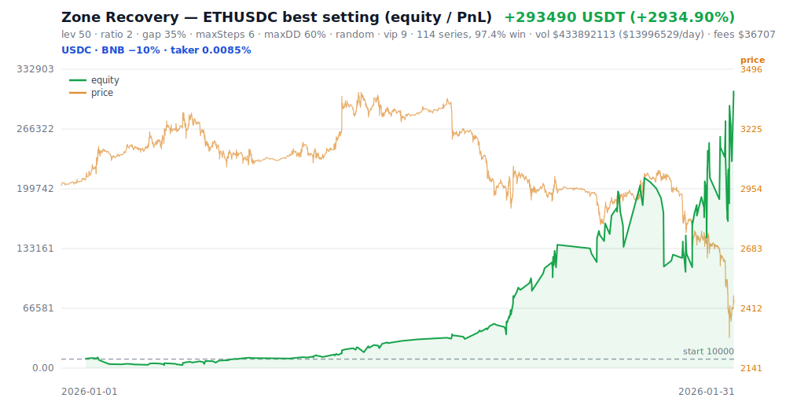

*Abb. 10: ETHUSDC, Januar 2026 — $10.000 → $303.490 (grün), realer ETH-Kurs (orange) im Hintergrund.*

Über **alle 37 Märkte** summiert bringt **allein der VIP-9-Tarif +$934.089 mehr** als der
Privatanleger-Tarif. Und bei **2 von 37** Märkten (DOGE, AAVE — die häufigsten Trader) **kippt das
Ergebnis bei VIP 0 ins Minus**, während VIP 9 sechsstellig gewinnt.

### 5.4 Ein einziger Extremtag schlägt einen ganzen Monat (alle USDC am 10.10.2025)

Zum direkten Vergleich wurde **derselbe Aufbau** auf den **einzelnen volatilsten Tag** angewandt — den
**10.10.2025** (die $19-Mrd.-Liquidationswelle). Ergebnis: **36 von 36 Märkten profitabel an EINEM Tag**,
Durchschnitt **+4.920 %**.

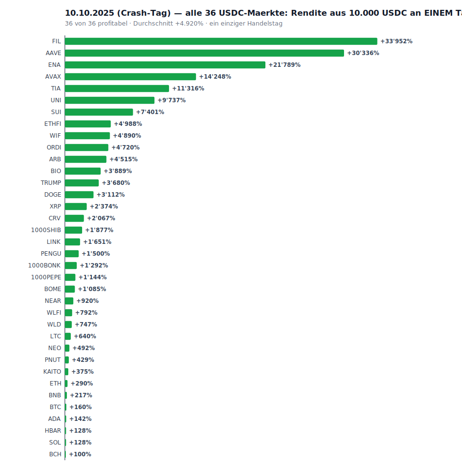

*Abb. 11: Ein einziger Crash-Tag, 36/36 Märkte grün; Spitzen über +30.000 %.*

| Markt | $10k → Ende (1 Tag) | Rendite | Serien | VIP-0-Ende |
| :--- | ---: | ---: | ---: | ---: |
| FILUSDC | $3.405.188 | +33.952 % | 1.070 | $2.924.062 |
| AAVEUSDC | $3.043.552 | +30.336 % | 722 | $2.635.910 |
| ENAUSDC | $2.188.950 | +21.789 % | 1.812 | $1.609.986 |
| AVAXUSDC | $1.434.792 | +14.248 % | 1.175 | $1.182.662 |
| TIAUSDC | $1.141.608 | +11.316 % | 1.032 | $751.686 |
| UNIUSDC | $983.742 | +9.737 % | 583 | $684.852 |
| *… weitere 30 Märkte, alle positiv (SUI +7.401 % … BCH +100 %)* | | | | |
| **Summe (36)** | **$18,07 Mio.** | Ø +4.920 % | | $14,62 Mio. |

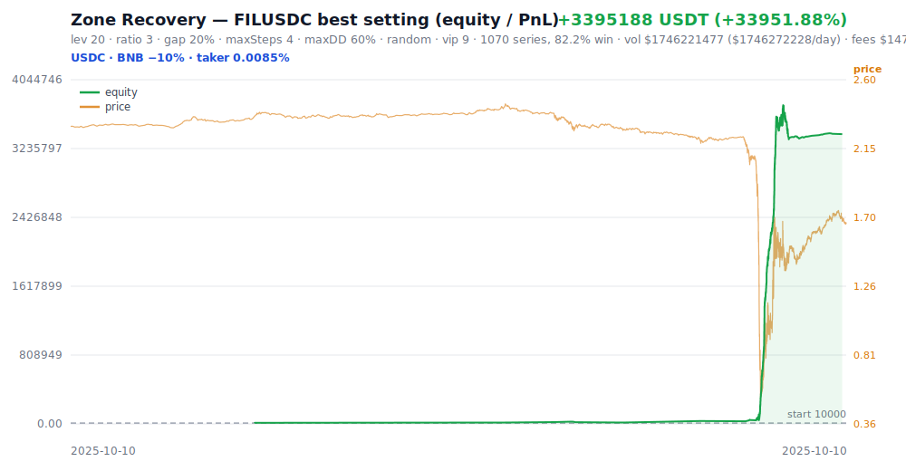

*Abb. 12: FILUSDC, nur der 10.10.2025 — $10.000 → $3,4 Mio. an einem einzigen Tag (grün), realer Kurs
(orange) im Hintergrund.*

**$10.000 auf jedem der 36 Märkte ($360.000 Einsatz) → $18,07 Mio. an einem einzigen Tag.**

#### Ein Tag (10.10.) vs. ein ganzer Monat (Januar) — dieselben Märkte

Der Crash-Tag bringt **pro Markt ein Vielfaches** eines ganzen ruhigen Monats — die Strategie ist ein
reiner **Volatilitäts-Ernter**:

| Markt | 10.10.2025 (1 Tag) | Januar 2026 (31 Tage) | 1 Tag ≈ |
| :--- | ---: | ---: | ---: |
| FILUSDC | +33.952 % | +1.367 % | **25 Monate** |
| AAVEUSDC | +30.336 % | +994 % | **31 Monate** |
| ENAUSDC | +21.789 % | +1.013 % | **22 Monate** |
| AVAXUSDC | +14.248 % | +293 % | **49 Monate** |
| UNIUSDC | +9.737 % | +1.119 % | 9 Monate |

> **Beweiskraft-Kasten (Abschnitt 5).** Die absoluten Beträge sind **simulativ** (im Nachhinein beste
> getestete Einstellung, also eine **Obergrenze**). Sie belegen, dass die Strategie **vor Gebühren** auf
> volatilen Daten **deutlich positiv** ist und bei **niedrigen** Gebühren auch **netto** positiv bleibt —
> über **37 Märkte** in einem normalen Monat **und** über **36 Märkte** an einem Extremtag (37/37 bzw.
> 36/36 profitabel untermauert zusätzlich die Richtungsunabhängigkeit). **Deterministisch** ist: gleiches
> Ergebnis vor Gebühren über alle Stufen; die Gebühr allein bestimmt, **wie viel** — und bei
> Vieltrader-Märkten sogar **ob** — übrig bleibt.

---

## 6. Warum „nur die Gebühr" eine **strukturelle** Benachteiligung ist

Die niedrigen Taker-Sätze sind an **30-Tage-Handelsvolumen** gebunden (offizielle Binance-Gebührenseite):

| Stufe | erforderliches 30-Tage-Volumen | Taker (USDC + BNB) |
| :--- | ---: | ---: |
| Privatanleger (VIP 0) | < 5 Mio. USD | 0,0360 % |
| VIP 3 | ≥ 50 Mio. USD | 0,0230 % |
| **VIP 9** | **≥ 25 Mrd. USD** | **0,0085 %** |

Die einzigen Stufen, die in der langen BTC-2019-Rechnung **überleben**, setzen **VIP 4+** voraus; der
volle Gewinn liegt bei **VIP 9**. **VIP 9 erfordert ≥ 25 Mrd. USD Handelsvolumen in 30 Tagen** — für
einen Privatanleger **unerreichbar**, für einen grossen Markt-Akteur Alltag. Damit ist die
Benachteiligung **strukturell**: Der Kleinanleger zahlt auf **jeden** Trade ein Vielfaches und wird von
**genau derselben** Strategie ruiniert, mit der ein Grosshändler Millionen macht.

---

## 7. Modellvalidierung (warum man den Zahlen trauen kann)

- **Realized Profit:** exakt reproduziert über **4.526 Positionszyklen** echter Binance-Exporte.
- **Gebühren:** über **87.806 Ausführungen bis auf 1·10⁻⁸** identisch zur „Fee"-Spalte der Exporte
  (Nominal × Satz, auf 8 Nachkommastellen gerundet).
- **Invariante:** das konstante Ergebnis je Serie vor Gebühren ist durch automatisierte Tests gesichert.
- **Reales Konto bestätigt den Mechanismus empirisch:** +$349,61 vor Gebühren über 5.813 Positionen, aber
  **−$59.840 Gebühren → −$77.633 Netto** — der Verlust entstand **allein aus der Kostenstruktur**
  (Schwester-Gutachten zum Realkonto im selben Repository).

---

## 8. Hochrechnung — und ihre ehrlichen Grenzen

**Frage:** Was wäre möglich, wenn man die Strategie **über viele Märkte** gleichzeitig und **Monat für
Monat** laufen liesse? Binance listet **über 700** USDⓈ-M-Perpetuals.

Bereits **belegt** ist (Abschnitt 5.3): **$10.000 auf jedem der 37 USDC-Märkte → $3,50 Mio. in einem
Monat** (Januar 2026, zufälliger Handel, VIP 9). Eine erweiterte Hochrechnung über **alle** Märkte sowie
eine **realistische Grosshändler-Simulation mit $100 Mio.** folgen in der nächsten Fassung dieses
Abschnitts (siehe Stand der laufenden Auswertung).

> ### ⚠️ Realitätscheck — was diese Hochrechnung **nicht** ist
> Die absoluten Beträge sind **Obergrenzen** (im Nachhinein beste getestete Einstellung), kein
> Versprechen. Folgendes ist **bewusst nicht** modelliert und würde das reale Ergebnis **senken**:
> - **Nachträgliche Einstellungswahl:** Die beste Einstellung kennt man live **vorher nicht**.
> - **Slippage:** Bei den umgewälzten Volumina bewegt man den Markt selbst; reale Ausführungen sind
>   schlechter als die Annahme.
> - **Liquidations-Risiko / Manipulation:** Eine **lange Einbahn-Bewegung ohne Rückkehr** kann eine Serie
>   — und das Konto — auslöschen. Genau das wird an Börsen an Extremtagen teils gezielt provoziert. Dieses
>   Risiko ist **nicht** modelliert (es zeigt sich in Trefferquoten < 100 %).
> - **Positionslimits & Kapital:** Jeder Markt deckelt die maximale Positionsgrösse; die ganz grossen
>   Faktoren sind **nicht** beliebig mit Kapital skalierbar (genau das prüft die $100-Mio.-Simulation).
> - **Finanzierungskosten** (Funding) über Nacht sind nicht enthalten.
>
> **Belastbar bleibt allein die deterministische Aussage:** vor Gebühren identisch, und **die
> Gebührenstufe** entscheidet über Gewinn/Verlust.

---

## 9. Schlussfolgerung

1. **Die Hedge-Methode funktioniert** — auf echten Binance-Daten ist die Strategie **vor Gebühren
   deutlich positiv**, und das **schon bei rein zufälligem Handel** (dem konservativen Boden; mit
   technischer Analyse wäre mehr drin).
2. **Allein die Gebührenstufe** kehrt das Ergebnis um: identische Trades führen den **Privatanleger in den
   Ruin** ($10.000 → $0) und den **Grosshändler zum Millionengewinn** ($10.000 → $1,5 Mio.) — *dieselben*
   Geschäfte, *dasselbe* Marktrisiko.
3. Die profitablen Sätze sind an **für Privatanleger unerreichbare Volumina** (≥ 25 Mrd. USD / 30 Tage)
   gebunden — die Benachteiligung ist **strukturell**, nicht handlungs- oder marktabhängig.
4. Die spektakulären Geldbeträge sind **simulative Obergrenzen** (im Nachhinein beste getestete
   Einstellung); der **belastbare** Kern ist die gebührenbedingte Vorzeichen-Umkehr.

**Es liegt eine strukturelle, allein gebührenbedingte Benachteiligung des Privatanlegers gegenüber den
höchsten Gebührenstufen vor — unabhängig von Handelsgeschick und Marktrichtung.**

---

## Anhang A — Reproduzierbarkeit

**Alles ist öffentlich und selbst nachrechenbar:** **https://github.com/mahapo/binance-case-stats**

Nach dem Klonen des Repositories genügen wenige Befehle; die echten Binance-Handelsdaten werden dabei
automatisch von der offiziellen Binance-Datenseite geladen:

```
Installation und Prüfung der Rechenlogik:   npm install   und   npm test
Ein Markt, ein Monat (z. B. der Crash-Tag): npm run backtest -- AVAXUSDC 2025-10-10
Ein voller Monat:                           npm run backtest -- ETHUSDC 2026-01
Ein Zeitraum (mehrere Monate):              npm run backtest -- SUIUSDC 2025-10 2026-01
```

- **Ausgabe je Lauf:** ein Ordner mit der Kapitalkurve (inkl. überlagertem Kurs), dem Gebührenstufen-
  Vergleich (VIP 0–9), dem vollständigen Handelslog und allen Kennzahlen.
- **Gebühren folgen dem Markt:** USDC-Märkte → günstigere USDC-Tabelle; USDT-Märkte → USDT-Tabelle.
- **Hebel/Positionsgrösse** sind auf die **realen Binance-Limits** des jeweiligen Marktes gedeckelt.
- Alle in diesem Dokument gezeigten Grafiken liegen im Repository unter `docs/zone-recovery/imgs/`.

---

*Deterministische Aussagen sind als solche gekennzeichnet; simulative Befunde (alle absoluten
Geldbeträge) sind offen als Obergrenzen (im Nachhinein beste getestete Einstellung) ausgewiesen.
Sämtliche Kennzahlen sind unter https://github.com/mahapo/binance-case-stats aus den realen
Binance-Daten reproduzierbar.*
